# Arquitectura — Clean Architecture aplicada a n8n

n8n no impone capas explícitas, pero el proyecto **Rivas Motors** las respeta implícitamente por convención de nombres y por cómo se reparte responsabilidad entre el workflow `MAIN` y los `SUB ·` workflows. Esta sección traduce esa organización al vocabulario de Clean Architecture (Uncle Bob) / Arquitectura Hexagonal, para que el sistema se pueda razonar, extender y testear por capas.

## Regla de dependencia

> Las capas externas dependen de las internas; las internas no conocen detalles de las externas.

En este proyecto:

- El **Dominio** (reglas de scoring, asignación de asesores, cálculo de precotización, reglas de agenda) vive en subworkflows que **no llaman directamente a WhatsApp/Chatwoot**; reciben datos ya normalizados y devuelven resultados estructurados (`{ ok, mensaje_agente, ... }`).
- La **Aplicación** (MAIN) orquesta el caso de uso "atender un mensaje de un lead", decide qué dominio invocar y en qué orden, pero delega el detalle de negocio a los subworkflows.
- La **Infraestructura** (Airtable, Redis, Chatwoot HTTP, Slack, OpenAI, Postgres, Monday.com) sólo es tocada por nodos concretos dentro de cada workflow — nunca se modela como si fuera parte del dominio.

```mermaid
flowchart TB
    subgraph L4["Infraestructura (Frameworks & Drivers)"]
        AIRTABLE[(Airtable\nCRM Rivas Motors)]
        REDIS[(Redis\nCache/Buffer/Locks)]
        CHATWOOT[Chatwoot API\nHTTP]
        SLACK[Slack API]
        OPENAI[OpenAI\nGPT + Whisper]
        PG[(Postgres\nChat Memory)]
        MONDAY[Monday.com]
        WHATSAPP[WhatsApp\nvía Chatwoot Inbox]
    end

    subgraph L3["Adaptadores de Interfaz (Triggers / Presenters)"]
        WEBHOOK[Webhook entrante\nChatwoot → n8n]
        WEBHOOK_LABEL[Webhook\nChatwoot Label]
        WEBHOOK_RESOLVE[Webhook\nChatwoot Resolve]
        CRON[Schedule Triggers\nCron]
        ERRTRIG[Error Trigger]
    end

    subgraph L2["Aplicación / Orquestación (Use Cases)"]
        MAIN["🔶 MAIN · Rivas Motors\n(orquestador por canal x2)"]
    end

    subgraph L1["Dominio (Reglas de negocio puras)"]
        LEAD[Lead Hydrator]
        GEO[Geo Router]
        SCORER[Lead Scorer]
        AGENDA[Agenda Manager]
        PRECOT[Calcular Precotización]
        ASESOR[Auto-Asignar Asesor]
        HANDOFF[Human Handoff]
        FIN[Financiera Inbound]
        MIRROR[CRM Mirrors\nSucursal / Región]
        INV[Inventory Lookup/Overview]
        FAQ[FAQ Lookup]
        PROMO[Promos Vigentes]
        MEDIA[Media Sender]
        CRMUPD[CRM Updater]
    end

    WHATSAPP --> WEBHOOK
    WEBHOOK --> MAIN
    WEBHOOK_LABEL --> L1
    WEBHOOK_RESOLVE --> L1
    CRON --> L1
    ERRTRIG --> L1

    MAIN --> LEAD & GEO & SCORER & AGENDA & PRECOT & ASESOR & HANDOFF & FIN & MIRROR & INV & FAQ & PROMO & MEDIA & CRMUPD

    LEAD & GEO & SCORER & AGENDA & PRECOT & ASESOR & HANDOFF & FIN & MIRROR & INV & FAQ & PROMO & MEDIA & CRMUPD --> AIRTABLE
    LEAD & INV & PROMO & ASESOR --> REDIS
    AGENDA & HANDOFF & ASESOR & FIN --> SLACK
    HANDOFF & MEDIA & FIN & AGENDA_R[Recordatorio/Nurturing] --> CHATWOOT
    MAIN --> OPENAI
    MAIN --> PG
    L1 -. sync .-> MONDAY
```

## Mapeo de capas

| Capa Clean Architecture | Elemento n8n | Responsabilidad |
|---|---|---|
| **Frameworks & Drivers** (infraestructura) | Nodos `httpRequest`, `airtable`, `redis`, `slack`, `postgres`, `mondayCom`, credenciales de `openAi` | Detalles técnicos de I/O. Reemplazables sin tocar reglas de negocio. |
| **Interface Adapters** (adaptadores de entrada/salida) | `webhook`, `scheduleTrigger`, `errorTrigger`, `executeWorkflowTrigger`, nodos `Set` que dan forma a la respuesta (`Set · Respuesta OK`, `Set · Lead Found`) | Traducen eventos externos (HTTP, cron) al formato interno, y formatean las respuestas de dominio de vuelta a HTTP/Slack. |
| **Application Business Rules** (casos de uso) | `🔶 MAIN · Rivas Motors` | Orquesta el caso de uso "procesar mensaje entrante": deduplica, hace debounce/buffer, arma contexto, decide ruteo (LLM Router), invoca al Agente Comercial (LLM con tools), despacha la respuesta y dispara post-procesos (scoring, mirror, asignación). |
| **Enterprise Business Rules** (dominio) | Sub-workflows de negocio puro: `Lead Scorer`, `Agenda Manager`, `Calcular Precotización`, `Auto-Asignar Asesor`, `Geo Router`, `Financiera Inbound`, `CRM Sucursal/Region Mirror` | Reglas que existirían igual si mañana el canal fuera Telegram en vez de WhatsApp: cómo se puntúa un lead, cómo se reparte round-robin entre asesores, cómo se calcula una mensualidad, cómo se resuelve la sucursal por ciudad. |

## Por qué el Agente LLM no rompe la regla de dependencia

El nodo `Agent · Comercial` (LangChain Agent, dentro de MAIN) consume 8 **tools** que en realidad son subworkflows de dominio expuestos como `toolWorkflow`:

- `Tool · Consultar Inventario` → `🗃️ SUB · Inventory Lookup`
- `Tool · Consultar Disponibilidad General` → `🗂️ SUB · Inventory Overview`
- `Tool · Consultar FAQ` → `🤔❓ SUB · FAQ Lookup`
- `Tool · Calcular Financiamiento` → `🏦 SUB · Calcular Precotización`
- `Tool · Agendar Cita` → `🗓️ SUB · Agenda Manager`
- `Tool · Handoff Asesor` → `👨🏻‍💻 SUB · Human Handoff`
- `Tool · Enviar Fotos` → `📸 SUB · Media Sender`
- `Tool · Actualizar Lead` → `📊📉 SUB · CRM Updater`

Esto es exactamente el patrón de **puerto/adaptador**: el LLM es un *driver* de aplicación que decide **cuándo** invocar un caso de uso de dominio, pero la lógica de negocio (cómo se calcula la mensualidad, cómo se valida una fecha de cita, cómo se reparte un asesor) vive encapsulada en el subworkflow, indiferente a que quien lo invocó fue un humano vía intención clasificada o un LLM vía tool-calling.

## Duplicación deliberada por canal (multi-tenant ligero)

`MAIN` contiene **dos copias casi idénticas** del mismo pipeline (nodos sufijados con `1`/`4` para el segundo canal). Un primer filtro (`If · Inbox Filter1`) enruta el evento entrante según el inbox de Chatwoot hacia:

- Rama **Rivas Motors** (nodos sin sufijo).
- Rama **Bajaj Sureste** (nodos con sufijo `1`/`4`, con un paso extra `Code · Time Context` para calcular horario/estado de asesor humano).

Ambas ramas reutilizan **los mismos subworkflows de dominio** (Lead Hydrator, Geo Router, Lead Scorer, etc.), que a su vez seleccionan la base de Airtable/las llaves de Redis correctas según `user_id_canal`/`sucursal`. Es decir: la duplicación vive sólo en la capa de aplicación (orquestación por canal), no en el dominio — lo cual es consistente con la regla de dependencia (el dominio es agnóstico al canal).

> **Nota de mejora potencial (fuera de alcance de esta documentación):** esta duplicación 1:1 de ~70 nodos por canal es deuda técnica típica de n8n (no hay herencia/composición nativa de sub-flows dentro de un mismo workflow). Un refactor futuro podría extraer el pipeline común a un único subworkflow parametrizado por `channel_config`, invocado dos veces desde un MAIN mucho más delgado.
