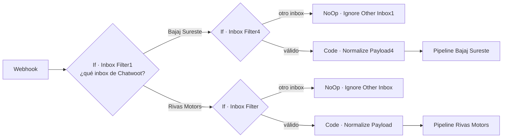
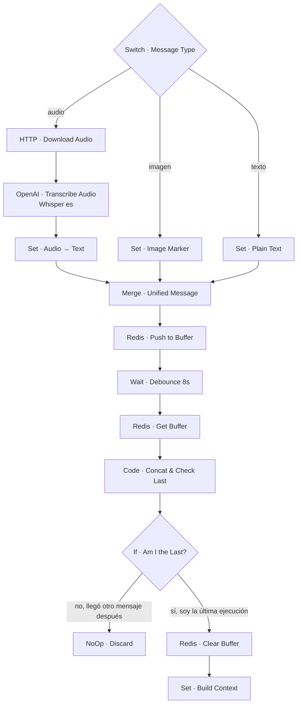
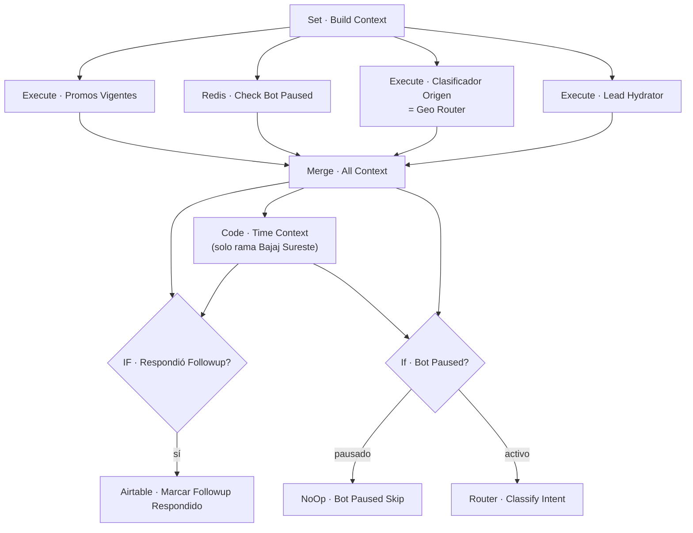
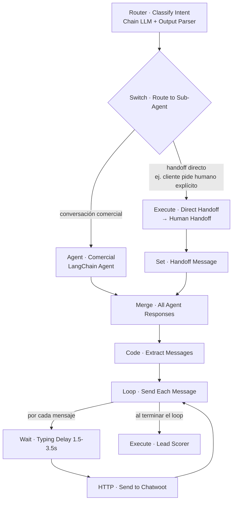
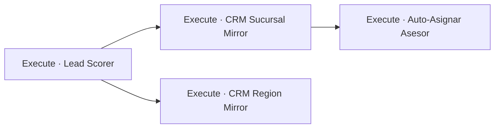

# `🔶 MAIN · Rivas Motors` — Orquestador principal

- **Archivo**: `Workflow/🔶 MAIN · Rivas Motors.json`
- **id**: `QehyRDWWUpntu0C0` · **activo**: sí
- **Nodos**: 137 (dos pipelines casi idénticos de ~68 nodos, uno por canal/marca)
- **Trigger único**: `Webhook` (`POST /20205206-e9fc-4d2b-bf1c-68558a71e035`) — recibe eventos de Chatwoot (que a su vez recibe WhatsApp vía Meta Cloud API).

## 1. Enrutamiento por canal



A partir de aquí, **ambas ramas ejecutan la misma secuencia lógica**; se describe una sola vez. Las diferencias puntuales entre ramas se marcan explícitamente.

## 2. Filtro de mensaje + pausa por intervención humana

```mermaid
flowchart TD
    NORM[Code · Normalize Payload] --> CONTACT{If · Is Contact Message?}
    CONTACT -->|no es del contacto\nej. lo escribió el asesor| NONCONTACT[NoOp · Ignore Non-Contact]
    NONCONTACT --> ASESOR_WROTE{If · ¿Escribió un Asesor?}
    ASESOR_WROTE -->|sí| PAUSE_SET[Redis · Pausar Bot]
    PAUSE_SET --> PAUSE_AT[Airtable · Marcar Bot Pausado]
    PAUSE_AT --> INVAL[Redis · Invalidate Cache]

    CONTACT -->|sí, es del cliente| DEDUPE1[Redis · Check Dedupe\nmsg:{message_id}]
    DEDUPE1 --> PROC{If · Already Processed?}
    PROC -->|sí| SKIP[NoOp · Already Processed]
    PROC -->|no| MARK[Redis · Dedupe Message]
    MARK --> FIN_CHECK{If · ¿Es la Financiera?}
    FIN_CHECK -->|sí, es el bot de la financiera| FIN_SUB[Execute · Financiera Inbound]
    FIN_CHECK -->|no, es un lead normal| TYPE{Switch · Message Type}
```

**Por qué importa**: cada vez que un **asesor humano** escribe en la conversación desde Chatwoot, el sistema detecta que el remitente no es el contacto, y si además viene de un asesor, pausa automáticamente al bot (`pause:{user_id_canal}` en Redis + flag en Airtable) para no chocar respuestas. La reactivación ocurre por dos vías independientes (ver `🏷️ Chatwoot Label Control` y `🔄 Chatwoot Reactivar Bot` en el catálogo de subworkflows).

## 3. Normalización multimodal + buffer/debounce



**Patrón clave — debounce colaborativo vía Redis**: cuando un cliente manda varios mensajes seguidos (ej. 3 audios), cada mensaje dispara su propia ejecución del workflow, pero todas comparten el mismo buffer en Redis (`buffer:{user_id_canal}`). Cada ejecución espera 8s y luego verifica si es la *última* en haber llegado; si no lo es, se descarta a sí misma (`NoOp · Discard`) dejando que solo la ejecución del último mensaje continúe con el buffer completo concatenado. Esto evita que el agente responda mensaje por mensaje y en su lugar procese la ráfaga completa como una sola intención.

## 4. Hidratación de contexto (paralela)



Cuatro llamadas a subworkflows de dominio se disparan **en paralelo** desde `Set · Build Context` y se combinan en `Merge · All Context` (modo *combine*):

| Subworkflow invocado | Qué aporta al contexto |
|---|---|
| `💦 Lead Hydrator` | Datos del lead (existente o recién creado) + lista de financieras activas, con cache en Redis. |
| `📍 Geo Router` | Ciudad/sucursal más probable del lead (match determinístico por código o, si ambiguo, resolución vía LLM). |
| `Redis · Check Bot Paused` | Flag directo de Redis (no es subworkflow) indicando si el bot está en pausa para ese usuario. |
| `🎟️ Promos Vigentes` | Promociones activas cacheadas, para que el agente las pueda mencionar sin ir a Airtable cada vez. |

## 5. Router de intención (LLM) → Agente Comercial



`Router · Classify Intent` es un `chainLlm` (modelo `gpt-5.4-mini`) con `outputParserStructured`, cuya única función es decidir si el mensaje debe ir directo a un humano o si lo puede atender el agente comercial. El **Agente Comercial** (`@n8n/n8n-nodes-langchain.agent`) es el corazón conversacional:

- **Modelo**: `gpt-5.4-mini` (`OpenAI · Agent Model`)
- **Memoria**: `Postgres Memory · Agent`, sesión = `user_id_canal` (persistencia de la conversación por usuario)
- **System prompt**: ~50k caracteres (rama Rivas Motors) / ~73k caracteres (rama Bajaj Sureste) — define personalidad, reglas de negocio, guardrails y formato de respuesta del vendedor virtual.
- **8 tools** (subworkflows de dominio expuestos como `toolWorkflow`, ver [01-Arquitectura](01-Arquitectura-Clean-Architecture.md#por-qué-el-agente-llm-no-rompe-la-regla-de-dependencia)).

La salida del agente (uno o varios mensajes) se **despacha secuencialmente** a Chatwoot con un delay aleatorio de "escribiendo…" (1.5–3.5s) entre cada uno para simular tipeo humano.

## 6. Post-proceso tras responder



Después de enviar la(s) respuesta(s), MAIN dispara — de forma "fire and forget" respecto a la respuesta al usuario — tres subworkflows de dominio que mantienen consistente el CRM distribuido:

1. **Lead Scorer**: recalcula el score del lead según señales de la conversación; si cruza el umbral de "hot lead", alerta por Slack.
2. **CRM Sucursal Mirror / CRM Region Mirror**: replican el lead (y sus citas) hacia la base de Airtable de la sucursal/región correspondiente (arquitectura de "maestro + espejos").
3. **Auto-Asignar Asesor**: si el lead no tiene asesor asignado y ya cumple condiciones, asigna uno por *weighted round-robin* y notifica por Slack/Chatwoot.

## Variables de contexto (payload interno)

Estos son los campos que `Set · Build Context` fija y que viajan (por referencia a nodos, `$('Set · Build Context').item.json.*`) a través de todo el pipeline y hacia los subworkflows invocados:

`user_id_canal`, `conversation_id`, `sender_name`, `channel`, `message`, `received_at`

## Diferencia entre las dos ramas (Rivas Motors vs. Bajaj Sureste)

| Aspecto | Rivas Motors | Bajaj Sureste |
|---|---|---|
| Sufijo de nodos | ninguno | `1` (y `4` en el segmento de filtro de inbox) |
| `Code · Time Context` | no existe | sí — calcula hora/día/estado del asesor humano antes de evaluar followup y pausa |
| Longitud system prompt del agente | ~49 699 caracteres | ~72 652 caracteres |
| Resto del pipeline | idéntico | idéntico |

Ambas ramas comparten **los mismos 22 subworkflows** físicos; la diferenciación de datos (qué sucursal, qué base de Airtable, qué credencial de Chatwoot) se resuelve dentro de esos subworkflows a partir de `user_id_canal` / `sucursal_id`, no en MAIN.
