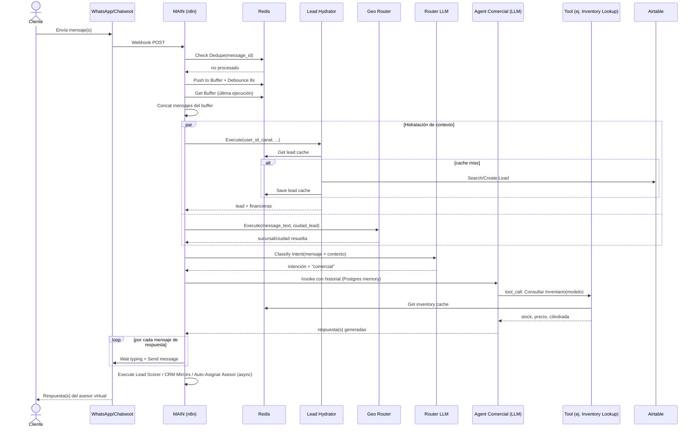
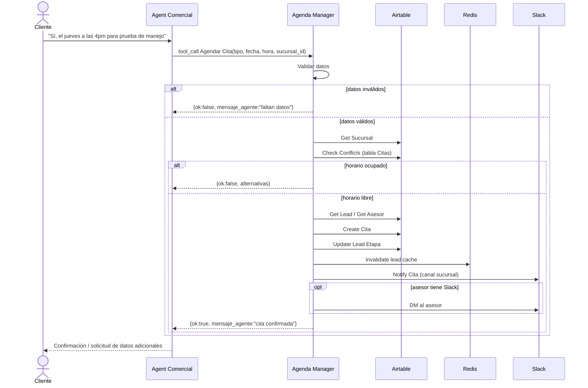
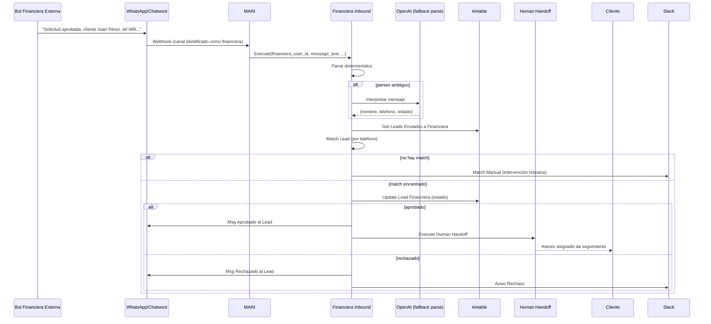
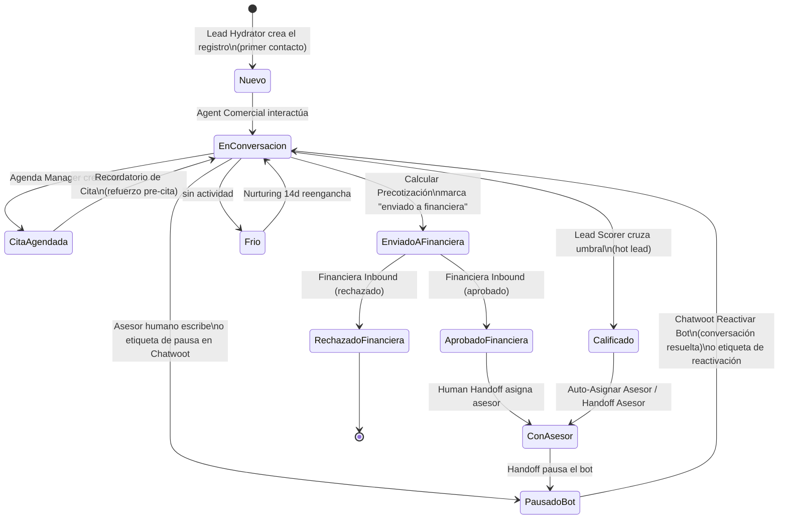
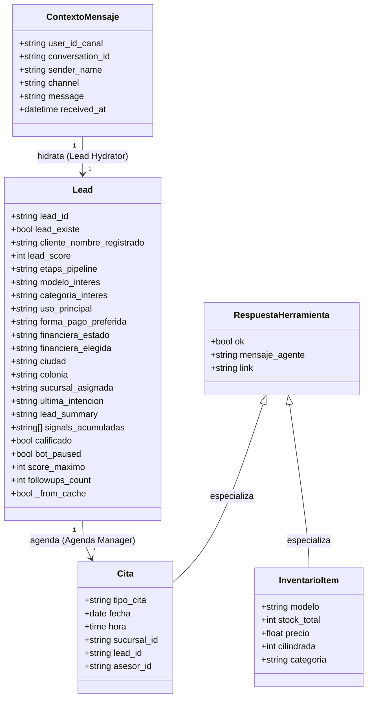

# Diagramas UML

## 1. Diagrama de Componentes (vista de sistema completo)

```mermaid
flowchart TB
    subgraph EXT["Sistemas Externos"]
        WA[WhatsApp\nMeta Cloud API]
        CW[Chatwoot]
        MON[Monday.com]
        FIN_EXT[Bot Financiera\nexterna]
    end

    subgraph N8N["n8n — Rivas Motors / Bajaj Sureste"]
        MAIN(("🔶 MAIN"))
        subgraph WEBHOOKS["Webhooks independientes"]
            LBL["🏷️ Chatwoot Label Control"]
            RES["🔄 Chatwoot Reactivar Bot"]
        end
        subgraph CRONS["Programados"]
            NUR["⏰ Nurturing 14d"]
            REC["⏰ Recordatorio de Cita"]
            RESU["⏰ Resumen Diario"]
            SYNCA["SYNC Asesores→Redis"]
            SYNCM["SYNC Monday→Airtable"]
        end
        subgraph DOM["Dominio"]
            LH["💦 Lead Hydrator"]
            GR["📍 Geo Router"]
            PV["🎟️ Promos Vigentes"]
            IL["🗃️ Inventory Lookup"]
            IO["🗂️ Inventory Overview"]
            FQ["🤔 FAQ Lookup"]
            PR["🏦 Calcular Precotización"]
            AG["🗓️ Agenda Manager"]
            MS["📸 Media Sender"]
            HH["👨‍💻 Human Handoff"]
            CU["📊 CRM Updater"]
            LS["🥇 Lead Scorer"]
            MSU["🪞 CRM Sucursal Mirror"]
            MRE["🪞 CRM Region Mirror"]
            AA["👤 Auto-Asignar Asesor"]
            FI["🏦 Financiera Inbound"]
        end
        ERR["⚠️ Error Handler Global"]
    end

    subgraph INFRA["Infraestructura"]
        AT[(Airtable\nCRM Rivas Motors\n+ N bases sucursal/región)]
        RD[(Redis)]
        SL[Slack]
        AI[OpenAI\nGPT-5.4-mini + Whisper]
        PG[(Postgres\nMemoria conversacional)]
    end

    WA <--> CW <--> MAIN
    CW --> LBL
    CW --> RES
    MON --> SYNCM
    FIN_EXT <--> FI

    MAIN --> LH & GR & PV & IL & IO & FQ & PR & AG & MS & HH & CU & LS & MSU & MRE & AA
    FI --> HH
    HH -.pausa/asigna.-> AA
    NUR & REC & RESU --> AT
    SYNCA --> RD
    SYNCM --> AT

    DOM --> AT
    DOM --> RD
    HH & AG & LS & AA & FI & SYNCA --> SL
    HH & MS & FI --> CW
    MAIN --> AI
    MAIN --> PG

    N8N -. errores no manejados .-> ERR
    ERR --> SL
    ERR --> CW
```

## 2. Diagrama de Secuencia — Mensaje entrante estándar (consulta comercial)

## 3. Diagrama de Secuencia — Agendar cita

## 4. Diagrama de Secuencia — Resultado de financiera externa

## 5. Diagrama de Estados — Ciclo de vida del Lead (inferido)

> Los nombres exactos de `etapa_pipeline` no están enumerados explícitamente en un solo lugar del JSON (se arman dinámicamente en código); este diagrama refleja las **transiciones observables** a través de qué subworkflow las provoca.

## 6. "Diagrama de Clases" — Entidades principales (derivadas de los campos que fijan los nodos `Set`)

> n8n no tiene clases; estas son las **formas de datos** (shape) que viajan entre workflows, reconstruidas a partir de los campos asignados en nodos `Set` / `Code` de salida. Se documentan como clase para dar una referencia de "contrato de datos" entre MAIN y los subworkflows.

