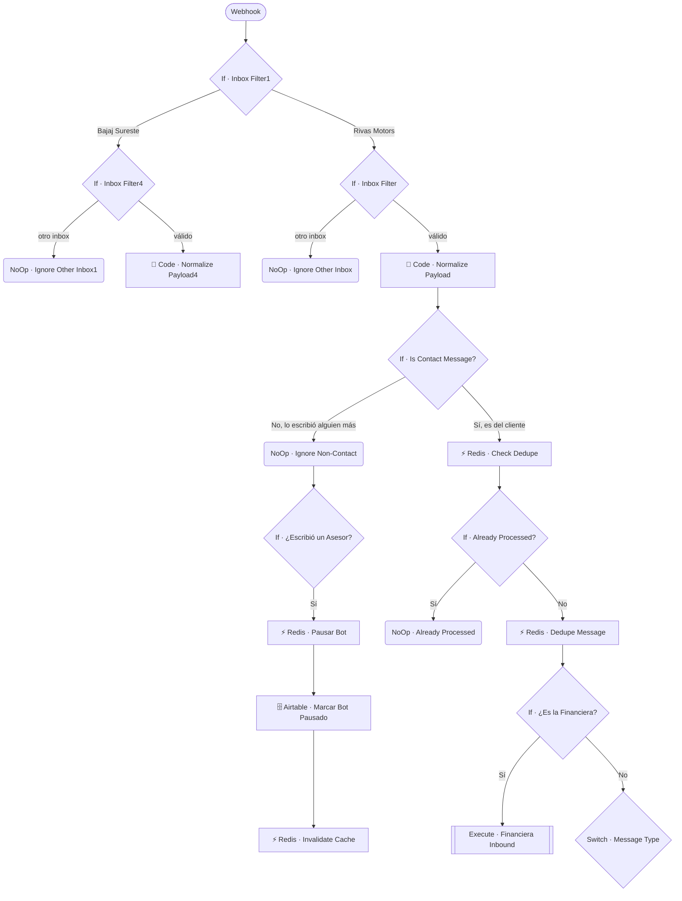
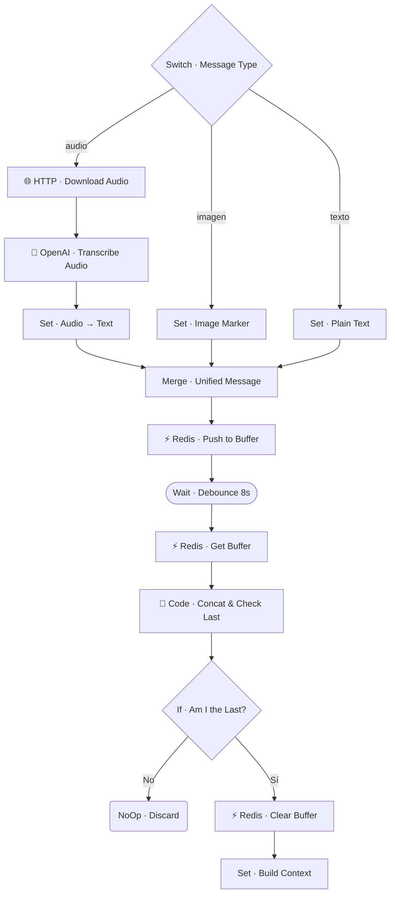
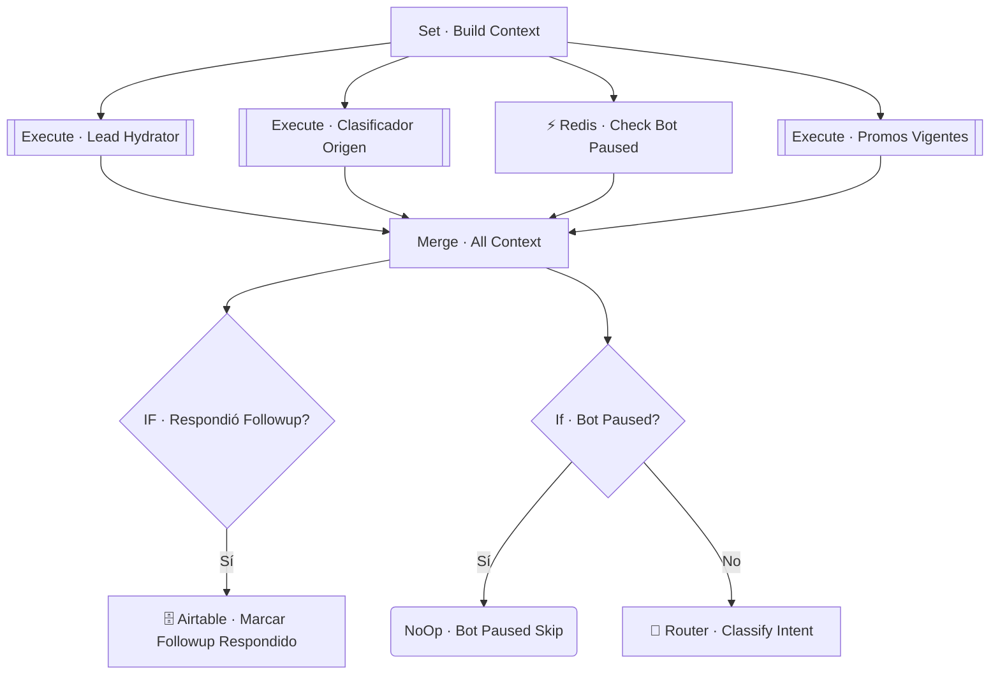
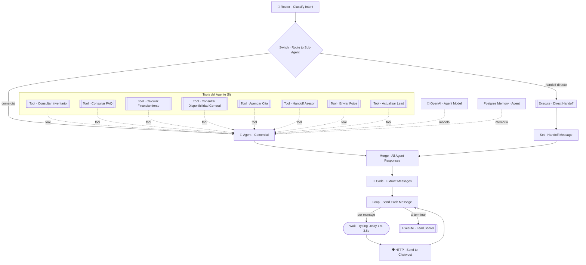
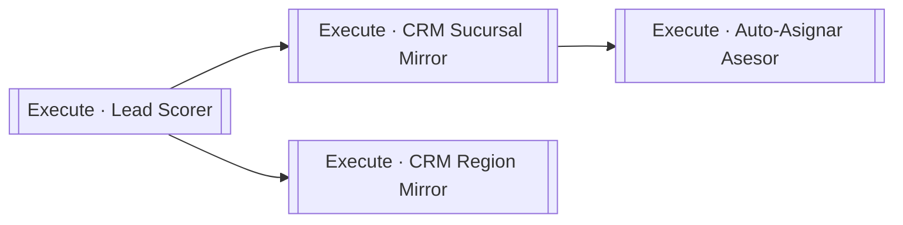

# 🔶 MAIN · Rivas Motors

| Campo | Valor |
|---|---|
| **Archivo fuente** | `Workflow/🔶 MAIN · Rivas Motors.json` |
| **ID n8n** | `QehyRDWWUpntu0C0` |
| **Estado** | Activo |
| **Categoría** | Orquestador (Application Layer) |
| **Nodos** | 137 |
| **Trigger** | `Webhook` único, `POST /20205206-e9fc-4d2b-bf1c-68558a71e035` |

## 1. Resumen

`MAIN` es el **único punto de entrada** del sistema: recibe todos los eventos de Chatwoot (mensajes entrantes de WhatsApp, mensajes salientes de asesores, cambios de estado) para **dos marcas/canales** — Rivas Motors y Bajaj Sureste — que comparten la misma instancia de n8n y los mismos 25 sub-workflows de dominio.

El workflow contiene **dos copias casi idénticas** del mismo pipeline (~68 nodos cada una, nodos de la segunda copia sufijados `1`/`4`), seleccionadas mediante un filtro de inbox de Chatwoot al inicio. Cada copia ejecuta: deduplicación, buffer/debounce de mensajes en ráfaga, transcripción de audio, hidratación de contexto del lead, clasificación de intención vía LLM, un agente conversacional (LangChain) con 8 herramientas de negocio, despacho de la respuesta a Chatwoot, y post-proceso de CRM.

## 2. Trigger

| Tipo | Configuración |
|---|---|
| `n8n-nodes-base.webhook` | `POST /20205206-e9fc-4d2b-bf1c-68558a71e035` — configurado como webhook de Chatwoot (evento `message_created` / `conversation_status_changed` según el payload) |

## 3. Contrato de datos

### Entrada
El payload crudo de Chatwoot se normaliza en `Code · Normalize Payload` (y su gemelo `...Payload4`) hacia esta forma interna, fijada en `Set · Build Context`:

| Campo | Descripción |
|---|---|
| `user_id_canal` | Identificador único del lead en su canal (WhatsApp) |
| `conversation_id` | ID de la conversación en Chatwoot |
| `sender_name` | Nombre visible del remitente |
| `channel` | Canal de origen (whatsapp) |
| `message` | Texto ya unificado (texto plano, transcripción de audio, o marcador de imagen) |
| `received_at` | Timestamp de recepción |

### Salida
`MAIN` no retorna datos a un caller (es un webhook, no un `executeWorkflowTrigger`): su "salida" es el efecto observable — uno o más mensajes enviados a Chatwoot vía `HTTP · Send to Chatwoot`, más los efectos secundarios de los sub-workflows de post-proceso.

## 4. Flujo del proceso

1. **Enrutamiento por canal** — `If · Inbox Filter1` decide si el evento pertenece al inbox de Bajaj Sureste o de Rivas Motors, y despacha a la copia de pipeline correspondiente.
2. **Filtro de mensaje y detección de intervención humana** — se descarta cualquier evento que no venga del inbox esperado (`Inbox Filter`) ni sea un mensaje real del contacto (`Is Contact Message?`). Si el mensaje **no** es del contacto y coincide con un asesor humano escribiendo, se pausa el bot automáticamente (`Redis · Pausar Bot` + `Airtable · Marcar Bot Pausado`).
3. **Deduplicación** — `Redis · Check Dedupe` con llave `msg:{message_id}` evita procesar el mismo evento de Chatwoot dos veces (reintentos de webhook).
4. **Ruteo temprano a Financiera** — antes de normalizar el tipo de mensaje, `If · ¿Es la Financiera?` detecta si el remitente es el bot de la financiera externa y, de ser así, deriva todo el procesamiento a `🏦 SUB · Financiera Inbound`, saltándose el resto del pipeline conversacional.
5. **Normalización multimodal** — `Switch · Message Type` separa audio (transcrito con Whisper vía `OpenAI · Transcribe Audio`), imagen (marcador de texto) y texto plano, y los unifica en `Merge · Unified Message`.
6. **Buffer/debounce colaborativo** — cada mensaje se empuja a una lista en Redis (`buffer:{user_id_canal}`); tras esperar 8s, la ejecución verifica si sigue siendo la última en llegar (`Code · Concat & Check Last`) — si no lo es, se descarta a sí misma, dejando que solo la última ejecución procese la ráfaga completa concatenada.
7. **Hidratación de contexto en paralelo** — `Set · Build Context` dispara simultáneamente `💦 Lead Hydrator`, `📍 Geo Router`, `Redis · Check Bot Paused` y `🎟️ Promos Vigentes`; los cuatro resultados se combinan en `Merge · All Context` (modo *combine*).
8. **Gate de pausa y followup** — si el bot está pausado, se detiene aquí (`NoOp · Bot Paused Skip`); si el mensaje responde a un followup pendiente, se marca respondido en Airtable.
9. **Router de intención (LLM)** — `Router · Classify Intent` (chain LLM + `outputParserStructured`) decide si el mensaje va directo a un humano o al agente comercial.
10. **Agente Comercial** — `Agent · Comercial` (LangChain Agent, `gpt-5.4-mini`, memoria en Postgres por `user_id_canal`, system prompt de ~50k–73k caracteres) resuelve la conversación invocando hasta 8 *tools* (sub-workflows de dominio).
11. **Despacho de respuesta** — `Code · Extract Messages` parte la respuesta del agente en mensajes individuales; `Loop · Send Each Message` los envía uno a uno a Chatwoot con un delay aleatorio de "escribiendo…" (1.5–3.5s) entre cada uno.
12. **Post-proceso** — tras enviar la respuesta, se disparan en cadena `🥇 Lead Scorer` → `🪞 CRM Sucursal Mirror` → `👤 Auto-Asignar Asesor`, y en paralelo `🪞 CRM Region Mirror`.

## 5. Diagramas de flujo (UML)

> Se documenta por fases para mantener legibilidad — cada fase es 100% fiel a las conexiones reales del JSON (rama sin sufijo; la rama `1`/`4` es idéntica salvo por el nodo extra `Code · Time Context`, señalado en la sección 8). El diagrama íntegro de 137 nodos está en el Anexo al final de este documento.

### 5.1 Enrutamiento de canal + filtro de mensaje

### 5.2 Normalización multimodal + buffer/debounce

### 5.3 Hidratación de contexto (paralela)

### 5.4 Router de intención → Agente Comercial → Despacho

### 5.5 Post-proceso tras responder

## 6. Integraciones externas

| Sistema | Uso |
|---|---|
| Chatwoot (HTTP) | Recepción de eventos (webhook) y envío de respuestas |
| Redis | Dedupe, buffer/debounce, flag de pausa del bot |
| OpenAI | Transcripción de audio (Whisper), router de intención y Agente Comercial (`gpt-5.4-mini`) |
| Postgres | Memoria conversacional del agente, por `user_id_canal` |
| Airtable | Marcar followups respondidos, marcar bot pausado (vía nodos directos, no solo sub-workflows) |

## 7. Relación con otros workflows

`MAIN` invoca directamente (vía `Execute Workflow` o como *tool* del agente) a **12 de los 25 sub-workflows** del proyecto:

| Sub-workflow | Mecanismo de invocación |
|---|---|
| 💦 Lead Hydrator | `executeWorkflow` (hidratación de contexto) |
| 📍 Geo Router | `executeWorkflow` (hidratación de contexto) |
| 🎟️ Promos Vigentes | `executeWorkflow` (hidratación de contexto) |
| 🗃️ Inventory Lookup | Tool del Agente |
| 🗂️ Inventory Overview | Tool del Agente |
| 🤔 FAQ Lookup | Tool del Agente |
| 🏦 Calcular Precotización | Tool del Agente |
| 🗓️ Agenda Manager | Tool del Agente |
| 📸 Media Sender | Tool del Agente |
| 👨‍💻 Human Handoff | Tool del Agente + `executeWorkflow` (ruteo directo) |
| 📊 CRM Updater | Tool del Agente |
| 🏦 Financiera Inbound | `executeWorkflow` (ruteo temprano por canal) |
| 🥇 Lead Scorer | `executeWorkflow` (post-proceso) |
| 🪞 CRM Sucursal Mirror | `executeWorkflow` (post-proceso) |
| 🪞 CRM Region Mirror | `executeWorkflow` (post-proceso) |
| 👤 Auto-Asignar Asesor | `executeWorkflow` (post-proceso) |

MAIN no es invocado por ningún otro workflow (es el punto de entrada del sistema).

## 8. Reglas de negocio y notas técnicas

- **Duplicación 1:1 por canal**: los ~68 nodos de la rama Bajaj Sureste son una copia exacta de los de Rivas Motors, con la única diferencia funcional del nodo `Code · Time Context` (calcula hora/día/estado del asesor humano antes de evaluar followup y pausa) — presente solo en la rama Bajaj Sureste. Esto es deuda técnica: un refactor razonable sería extraer el pipeline común a un sub-workflow parametrizado por configuración de canal.
- **Nodos deshabilitados**: `WhatsApp · Typing On` / `WhatsApp · Typing (loop)` (y sus copias `...1`) están **deshabilitados** en ambas ramas — el efecto de "escribiendo…" real hacia el usuario final vía Meta Cloud API no está activo; el delay simulado (`Wait · Typing Delay`) sigue funcionando igual.
- **Longitud del system prompt del agente**: ~49 699 caracteres en Rivas Motors vs. ~72 652 en Bajaj Sureste — variación no documentada en el propio proyecto que conviene auditar si ambas marcas deberían compartir el mismo prompt base.
- **Orden de evaluación importante**: el chequeo `If · ¿Es la Financiera?` ocurre **antes** de clasificar el tipo de mensaje (audio/imagen/texto), por lo que un mensaje de la financiera nunca pasa por transcripción de audio ni por el buffer/debounce — se asume que siempre llega como texto plano.

---

## Anexo — Diagrama completo (137 nodos, ambas ramas)

```mermaid
flowchart TD
    n_Webhook(["Webhook"]) --> n_If___Inbox_Filter1{"If · Inbox Filter1"}
    n_If___Inbox_Filter1 -->|Sí| n_If___Inbox_Filter4{"If · Inbox Filter4"}
    n_If___Inbox_Filter1 -->|No| n_If___Inbox_Filter{"If · Inbox Filter"}

    n_If___Inbox_Filter -->|Sí| n_Code___Normalize_Payload["🧩 Code · Normalize Payload"]
    n_If___Inbox_Filter -->|No| n_NoOp___Ignore_Other_Inbox("NoOp · Ignore Other Inbox")
    n_Code___Normalize_Payload --> n_If___Is_Contact_Message_{"If · Is Contact Message?"}
    n_If___Is_Contact_Message_ -->|Sí| n_Redis___Check_Dedupe["⚡ Redis · Check Dedupe"]
    n_If___Is_Contact_Message_ -->|No| n_NoOp___Ignore_Non_Contact("NoOp · Ignore Non-Contact")
    n_NoOp___Ignore_Non_Contact --> n_If____Escribi__un_Asesor_{"If · ¿Escribió un Asesor?"}
    n_If____Escribi__un_Asesor_ -->|Sí| n_Redis___Pausar_Bot__asesor_act["⚡ Redis · Pausar Bot"]
    n_Redis___Pausar_Bot__asesor_act --> n_Airtable___Marcar_Bot_Pausado["🗄️ Airtable · Marcar Bot Pausado"]
    n_Airtable___Marcar_Bot_Pausado --> n_Redis___Invalidate_Cache__paus["⚡ Redis · Invalidate Cache"]
    n_Redis___Check_Dedupe --> n_If___Already_Processed_{"If · Already Processed?"}
    n_If___Already_Processed_ -->|Sí| n_NoOp___Already_Processed("NoOp · Already Processed")
    n_If___Already_Processed_ -->|No| n_Redis___Dedupe_Message["⚡ Redis · Dedupe Message"]
    n_Redis___Dedupe_Message --> n_If____Es_la_Financiera_{"If · ¿Es la Financiera?"}
    n_If____Es_la_Financiera_ -->|Sí| n_Execute___Financiera_Inbound[["Execute · Financiera Inbound"]]
    n_If____Es_la_Financiera_ -->|No| n_Switch___Message_Type{"Switch · Message Type"}
    n_Switch___Message_Type -->|audio| n_HTTP___Download_Audio["🌐 HTTP · Download Audio"]
    n_Switch___Message_Type -->|imagen| n_Set___Image_Marker["Set · Image Marker"]
    n_Switch___Message_Type -->|texto| n_Set___Plain_Text["Set · Plain Text"]
    n_HTTP___Download_Audio --> n_OpenAI___Transcribe_Audio["🧠 OpenAI · Transcribe Audio"]
    n_OpenAI___Transcribe_Audio --> n_Set___Audio___Text["Set · Audio → Text"]
    n_Set___Audio___Text --> n_Merge___Unified_Message["Merge · Unified Message"]
    n_Set___Image_Marker --> n_Merge___Unified_Message
    n_Set___Plain_Text --> n_Merge___Unified_Message
    n_Merge___Unified_Message --> n_Redis___Push_to_Buffer["⚡ Redis · Push to Buffer"]
    n_Redis___Push_to_Buffer --> n_Wait___Debounce(["Wait · Debounce"])
    n_Wait___Debounce --> n_Redis___Get_Buffer["⚡ Redis · Get Buffer"]
    n_Redis___Get_Buffer --> n_Code___Concat___Check_Last["🧩 Code · Concat & Check Last"]
    n_Code___Concat___Check_Last --> n_If___Am_I_the_Last_{"If · Am I the Last?"}
    n_If___Am_I_the_Last_ -->|Sí| n_Redis___Clear_Buffer["⚡ Redis · Clear Buffer"]
    n_If___Am_I_the_Last_ -->|No| n_NoOp___Discard__not_last_("NoOp · Discard")
    n_Redis___Clear_Buffer --> n_Set___Build_Context["Set · Build Context"]
    n_Set___Build_Context --> n_Execute___Clasificador_Origen[["Execute · Clasificador Origen"]]
    n_Set___Build_Context --> n_Redis___Check_Bot_Paused["⚡ Redis · Check Bot Paused"]
    n_Set___Build_Context --> n_Execute___Lead_Hydrator[["Execute · Lead Hydrator"]]
    n_Set___Build_Context --> n_Execute___Promos_Vigentes[["Execute · Promos Vigentes"]]
    n_Execute___Lead_Hydrator --> n_Merge___All_Context["Merge · All Context"]
    n_Execute___Clasificador_Origen --> n_Merge___All_Context
    n_Redis___Check_Bot_Paused --> n_Merge___All_Context
    n_Execute___Promos_Vigentes --> n_Merge___All_Context
    n_Merge___All_Context --> n_If___Bot_Paused_{"If · Bot Paused?"}
    n_Merge___All_Context --> n_IF___Respondi__Followup_{"IF · Respondió Followup?"}
    n_If___Bot_Paused_ -->|Sí| n_NoOp___Bot_Paused__Skip_("NoOp · Bot Paused Skip")
    n_If___Bot_Paused_ -->|No| n_Router___Classify_Intent["🤖 Router · Classify Intent"]
    n_IF___Respondi__Followup_ -->|Sí| n_Airtable___Marcar_Followup_Res["🗄️ Airtable · Marcar Followup Respondido"]
    n_Router___Classify_Intent --> n_Switch___Route_to_Sub_Agent{"Switch · Route to Sub-Agent"}
    n_Switch___Route_to_Sub_Agent -->|handoff directo| n_Execute___Direct_Handoff[["Execute · Direct Handoff"]]
    n_Switch___Route_to_Sub_Agent -->|comercial| n_Agent___Comercial["🤖 Agent · Comercial"]
    n_Agent___Comercial --> n_Merge___All_Agent_Responses["Merge · All Agent Responses"]
    n_Execute___Direct_Handoff --> n_Set___Handoff_Message["Set · Handoff Message"]
    n_Set___Handoff_Message --> n_Merge___All_Agent_Responses
    n_Merge___All_Agent_Responses --> n_Code___Extract_Messages["🧩 Code · Extract Messages"]
    n_Code___Extract_Messages --> n_Loop___Send_Each_Message["Loop · Send Each Message"]
    n_Loop___Send_Each_Message --> n_Execute___Lead_Scorer[["Execute · Lead Scorer"]]
    n_Wait___Typing_Delay(["Wait · Typing Delay"]) --> n_HTTP___Send_to_Chatwoot["🌐 HTTP · Send to Chatwoot"]
    n_HTTP___Send_to_Chatwoot --> n_Loop___Send_Each_Message
    n_Execute___Lead_Scorer --> n_Execute___CRM_Sucursal_Mirror[["Execute · CRM Sucursal Mirror"]]
    n_Execute___Lead_Scorer --> n_Execute___CRM_Region_Mirror[["Execute · CRM Region Mirror"]]
    n_Execute___CRM_Sucursal_Mirror --> n_Execute___Auto_Asignar_Asesor[["Execute · Auto-Asignar Asesor"]]

    subgraph Rama_Bajaj["Rama Bajaj Sureste (idéntica + Time Context)"]
        n_If___Inbox_Filter4 -.-> RB["... 68 nodos espejo, sufijo 1/4 ..."]
    end
```

Expandir diagrama completo de MAIN (denso — usar solo como referencia técnica exhaustiva)

*(El diagrama completo generado nodo-por-nodo, incluyendo la rama Bajaj Sureste íntegra, se encuentra en el archivo fuente `Workflow/🔶 MAIN · Rivas Motors.json`; se omite aquí en su forma de 137 nodos por ser ilegible como imagen única — las secciones 5.1–5.5 son la representación UML recomendada para lectura humana.)*

