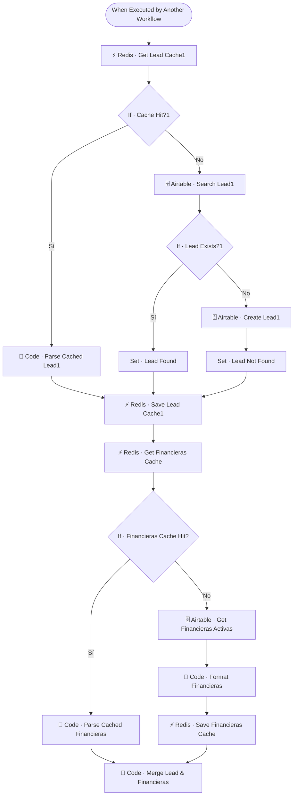

# 💦 SUB · Lead Hydrator

| Campo | Valor |
|---|---|
| **Archivo fuente** | `Workflow/Sub-Worflow/💦 SUB · Lead Hydrator (Rivas Motors- Bajaja Sureste).json` |
| **ID n8n** | `XDtW6uPfubCo4kvH` |
| **Estado** | Activo |
| **Categoría** | Dominio — Hidratación de contexto |
| **Nodos** | 17 |
| **Trigger** | `executeWorkflowTrigger` (invocado únicamente por `MAIN`) |

## 1. Resumen

Obtiene (o crea) el registro del lead en el CRM y adjunta el catálogo de financieras activas, con **cache-aside en Redis** en ambos casos. Es el primer sub-workflow que se ejecuta en la hidratación de contexto de `MAIN`, y su salida es el objeto "lead" que viaja durante todo el resto de la conversación.

## 2. Trigger

`n8n-nodes-base.executeWorkflowTrigger` — inputs declarados: `user_id_canal`, `channel`, `sender_name`, `conversation_id`, entre otros campos de contexto del mensaje.

## 3. Contrato de datos

### Entrada
| Campo | Tipo | Descripción |
|---|---|---|
| `user_id_canal` | string | Identificador del lead en su canal |
| `channel` | string | Canal de origen |
| `sender_name` | string | Nombre del remitente |
| `conversation_id` | string | ID de conversación en Chatwoot |

### Salida
Objeto lead completo (`Set · Lead Found` / `Set · Lead Not Found`):

`lead_existe`, `lead_id`, `cliente_nombre_registrado`, `lead_score`, `etapa_pipeline`, `modelo_interes`, `categoria_interes`, `uso_principal`, `forma_pago_preferida`, `forma_pago_preferida`, `financiera_estado`, `ciudad`, `colonia`, `ultima_intencion`, `lead_summary`, `signals_acumuladas`, `calificado`, `bot_paused`, `score_maximo`, `followups_count`, `_from_cache`, `financiera_elegida`, `sucursal_asignada` — más `financieras_disponibles` (lista formateada de financieras activas).

## 4. Flujo del proceso

1. Consulta en Redis la cache del lead (`lead:{user_id_canal}`).
2. **Cache hit**: parsea el JSON cacheado. **Cache miss**: busca el lead en Airtable (`Leads`); si no existe, lo crea.
3. En paralelo (tras resolver el lead), consulta la cache de financieras activas (`financieras:activas`); si no está cacheada, la trae de Airtable y la formatea.
4. Combina lead + financieras en un solo objeto de salida y repuebla ambas caches en Redis.

## 5. Diagrama de flujo (UML)

## 6. Integraciones externas

| Sistema | Uso |
|---|---|
| Airtable | Tablas `Leads`, `Financieras` |
| Redis | Cache-aside de lead (`lead:{id}`) y financieras (`financieras:activas`) |

## 7. Relación con otros workflows

- **Invocado por**: `🔶 MAIN` (ambas ramas de canal), como parte de la hidratación de contexto en paralelo.
- **Invoca a**: ninguno.

## 8. Reglas de negocio y notas técnicas

- Patrón **Cache-Aside** aplicado dos veces en el mismo workflow (lead y financieras), cada uno con su propia llave y ciclo de vida independiente.
- La creación de un lead nuevo (`Airtable · Create Lead1`) ocurre automáticamente en el primer contacto — no hay paso de confirmación; cualquier `user_id_canal` desconocido se convierte en lead.
