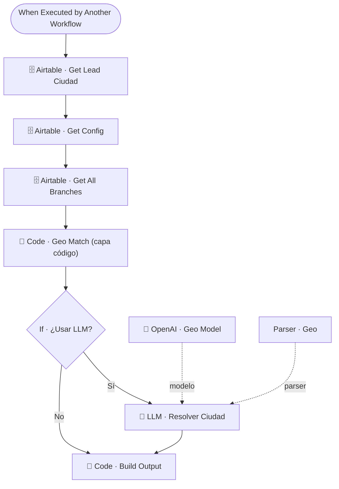

# 📍🗺️ SUB · Geo Router

| Campo | Valor |
|---|---|
| **Archivo fuente** | `Workflow/Sub-Worflow/📍🗺️ SUB · Geo Router (Rivas Motors- Bajaja Sureste).json` |
| **ID n8n** | `rDRJ8VP7p1H0ziRv` |
| **Estado** | Activo |
| **Categoría** | Dominio — Hidratación de contexto |
| **Nodos** | 10 |
| **Trigger** | `executeWorkflowTrigger` (invocado únicamente por `MAIN`) |

## 1. Resumen

Resuelve a qué sucursal/ciudad pertenece un lead, usando primero un **match determinístico por código** contra el catálogo de sucursales y, solo si resulta ambiguo, un **LLM de respaldo** que infiere la ciudad a partir del texto libre del cliente. Es el patrón de *fallback en cascada* que se repite en otros sub-workflows del proyecto (FAQ Lookup nunca lo necesita, pero Financiera Inbound sí).

## 2. Trigger

`executeWorkflowTrigger` — inputs: `message_text`, `user_id_canal`, `ciudad_lead`.

## 3. Contrato de datos

### Entrada
| Campo | Descripción |
|---|---|
| `message_text` | Texto del mensaje del cliente (para inferencia de ciudad) |
| `user_id_canal` | Identificador del lead |
| `ciudad_lead` | Ciudad ya conocida del lead, si existe |

### Salida
Objeto con la sucursal/ciudad resuelta (`Code · Build Output`), construido a partir de la config de negocio (`_cfg`), el listado de sucursales (`_todas`) y el resultado del match (código o LLM).

## 4. Flujo del proceso

1. Trae el lead completo y la configuración de negocio + catálogo de sucursales desde Airtable.
2. `Code · Geo Match (capa código)` intenta resolver la ciudad/sucursal con reglas determinísticas (comparación de texto contra el catálogo).
3. Si el match de código es ambiguo o insuficiente (`If · ¿Usar LLM?`), delega a `LLM · Resolver Ciudad` (chain LLM + `outputParserStructured`) para inferir la ciudad desde el lenguaje natural del cliente.
4. `Code · Build Output` combina el resultado (de código o de LLM) con la configuración y el catálogo, y arma la respuesta final.

## 5. Diagrama de flujo (UML)

## 6. Integraciones externas

| Sistema | Uso |
|---|---|
| Airtable | Tablas `Config`, `Sucursales`, `Leads` |
| OpenAI | Resolución de ciudad ambigua vía LLM (fallback) |

## 7. Relación con otros workflows

- **Invocado por**: `🔶 MAIN` (hidratación de contexto en paralelo).
- **Invoca a**: ninguno.

## 8. Reglas de negocio y notas técnicas

- Patrón **reglas-primero, LLM-como-respaldo**: minimiza costo/latencia de OpenAI, usándolo solo cuando el match determinístico no es suficiente.
- Comparte esta misma estrategia de diseño con `🏦 Financiera Inbound` (ver ese documento) — es una convención de arquitectura consistente en el proyecto para interpretar texto libre.
