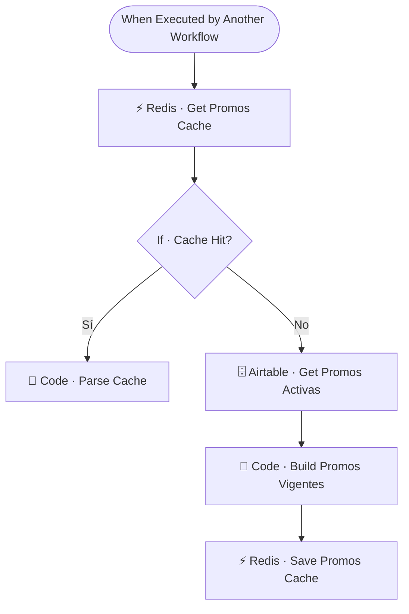

# 🎟️ SUB · Promos Vigentes

| Campo | Valor |
|---|---|
| **Archivo fuente** | `Workflow/Sub-Worflow/🎟️ SUB · Promos Vigentes (Rivas Motors- Bajaja Sureste).json` |
| **ID n8n** | `RPHS2Bg0g0atwaGy` |
| **Estado** | Activo |
| **Categoría** | Dominio — Hidratación de contexto |
| **Nodos** | 7 |
| **Trigger** | `executeWorkflowTrigger` (invocado por `MAIN`) |

## 1. Resumen

Devuelve las promociones vigentes de la agencia, con cache global en Redis. Se invoca en cada mensaje entrante para que el contexto del agente comercial siempre incluya las promos activas sin tener que consultar Airtable en cada turno de conversación.

## 2. Trigger

`executeWorkflowTrigger` — input: `user_id_canal` (no se usa para filtrar, solo se recibe por convención de firma común entre sub-workflows de contexto).

## 3. Contrato de datos

### Salida
Objeto con la lista de promociones activas formateada, cacheado bajo la llave global `promos:__vigentes__` (no depende del usuario — es información compartida por todos los leads).

## 4. Flujo del proceso

1. Consulta la cache global de promociones en Redis.
2. **Cache hit**: parsea el JSON cacheado. **Cache miss**: consulta la tabla `Promociones` en Airtable, filtra las vigentes y las formatea.
3. Guarda el resultado en cache para las siguientes invocaciones.

## 5. Diagrama de flujo (UML)

## 6. Integraciones externas

| Sistema | Uso |
|---|---|
| Airtable | Tabla `Promociones` |
| Redis | Cache global `promos:__vigentes__` |

## 7. Relación con otros workflows

- **Invocado por**: `🔶 MAIN` (hidratación de contexto) y como fuente de datos para `📸 Media Sender` (flyer de promo).
- **Invoca a**: ninguno.

## 8. Reglas de negocio y notas técnicas

- Cache **global**, no por usuario — correcto dado que las promociones son iguales para todos los leads; evita cachear el mismo dato N veces por usuario.
