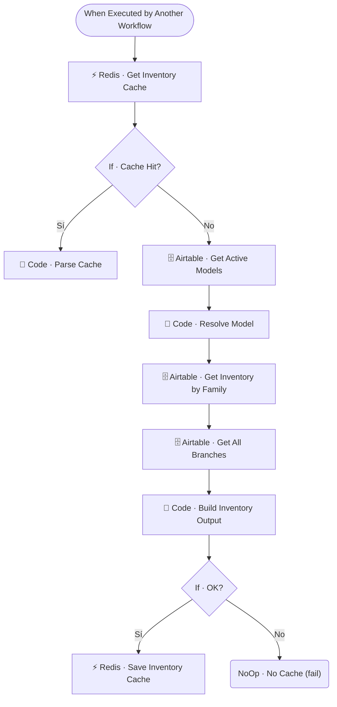

# 🗃️ SUB · Inventory Lookup

| Campo | Valor |
|---|---|
| **Archivo fuente** | `Workflow/Sub-Worflow/🗃️ SUB · Inventory Lookup (Rivas Motors - Bajaja Sureste).json` |
| **ID n8n** | `sDKToIjcDfhazbNV` |
| **Estado** | Activo |
| **Categoría** | Dominio — Tool del Agente Comercial |
| **Nodos** | 12 |
| **Trigger** | `executeWorkflowTrigger`, expuesto como *tool* (`Tool · Consultar Inventario`) al Agente Comercial de `MAIN` |

## 1. Resumen

Dado el nombre de un modelo de moto (potencialmente escrito de forma imprecisa por el cliente), resuelve la familia/modelo exacto en el catálogo y devuelve **stock sumado entre todas las sucursales**, precio, cilindrada y categoría. Es la herramienta que el Agente Comercial usa cuando el cliente pregunta por disponibilidad de un modelo específico.

## 2. Trigger

`executeWorkflowTrigger` — inputs: `modelo`, `user_id_canal`. El campo `description` del nodo tool en MAIN indica al LLM: *"Consulta disponibilidad y precio de un modelo de moto. Devuelve stock disponible (sumado entre sucursales), precio, cilindrada y categoría."*

## 3. Contrato de datos

### Salida
Objeto con stock total, precio, cilindrada y categoría del modelo resuelto, cacheado por modelo (`inventario:{modelo}`).

## 4. Flujo del proceso

1. Consulta cache de inventario para el modelo solicitado.
2. **Cache miss**: trae los modelos activos de Airtable, resuelve cuál corresponde al texto libre del cliente (`Code · Resolve Model` — normaliza variantes de escritura), y consulta el inventario de esa familia en todas las sucursales.
3. Construye el objeto de salida (`Code · Build Inventory Output`); si no se pudo resolver el modelo, retorna un estado de fallo sin cachear (`NoOp · No Cache (fail)`).
4. Si todo salió bien, cachea el resultado para próximas consultas del mismo modelo.

## 5. Diagrama de flujo (UML)

## 6. Integraciones externas

| Sistema | Uso |
|---|---|
| Airtable | Tablas `Modelos`, `Inventario`, `Sucursales` |
| Redis | Cache por modelo (`inventario:{modelo}`) |

## 7. Relación con otros workflows

- **Invocado por**: `🔶 MAIN`, como tool del Agente Comercial (`Tool · Consultar Inventario`).
- **Invoca a**: ninguno.

## 8. Reglas de negocio y notas técnicas

- La resolución de modelo (`Code · Resolve Model`) es crítica: el cliente puede escribir el modelo con errores tipográficos, abreviado o parcial — este nodo es el que absorbe esa variabilidad antes de tocar Airtable.
- Errores silenciosos: si `If · OK?` falla, no se cachea nada, evitando que un fallo puntual quede persistido como respuesta futura.
