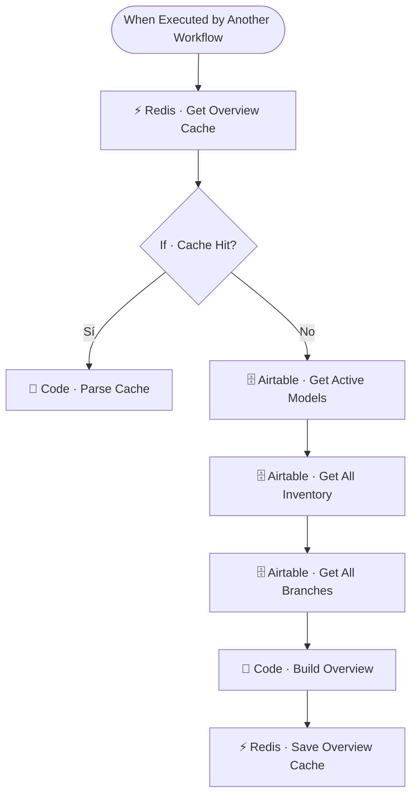

# 🗂️ SUB · Inventory Overview

| Campo | Valor |
|---|---|
| **Archivo fuente** | `Workflow/Sub-Worflow/🗂️ SUB · Inventory Overview (Rivas Motors - Bajaja Sureste).json` |
| **ID n8n** | `mp5BdtdTOy3sJhp1` |
| **Estado** | Activo |
| **Categoría** | Dominio — Tool del Agente Comercial |
| **Nodos** | 9 |
| **Trigger** | `executeWorkflowTrigger`, expuesto como *tool* (`Tool · Consultar Disponibilidad General`) |

## 1. Resumen

Devuelve un snapshot de disponibilidad de **todos los modelos activos** de un jalón, para cuando el cliente pregunta en general "qué motos manejan" o quiere comparar catálogo, en vez de preguntar por un modelo puntual (ese caso lo cubre `🗃️ Inventory Lookup`).

## 2. Trigger

`executeWorkflowTrigger` — input: `user_id_canal`.

## 3. Contrato de datos

### Salida
Listado de todos los modelos activos con su disponibilidad agregada, cacheado bajo la llave global `inventario:__overview__`.

## 4. Flujo del proceso

1. Consulta la cache global del overview de inventario.
2. **Cache miss**: trae modelos activos, todo el inventario y todas las sucursales de Airtable, y construye el resumen completo (`Code · Build Overview`).
3. Guarda el resultado en cache.

## 5. Diagrama de flujo (UML)

## 6. Integraciones externas

| Sistema | Uso |
|---|---|
| Airtable | Tablas `Modelos`, `Inventario`, `Sucursales` |
| Redis | Cache global `inventario:__overview__` |

## 7. Relación con otros workflows

- **Invocado por**: `🔶 MAIN`, como tool del Agente Comercial.
- **Invoca a**: ninguno.

## 8. Reglas de negocio y notas técnicas

- Al igual que Promos Vigentes, usa cache **global** (no por usuario) — es el patrón correcto para datos compartidos entre todos los leads.
- No filtra por modelo, a diferencia de `Inventory Lookup`; ambos sub-workflows comparten el mismo origen de datos (`Modelos`, `Inventario`, `Sucursales`) pero con distinto nivel de agregación.
