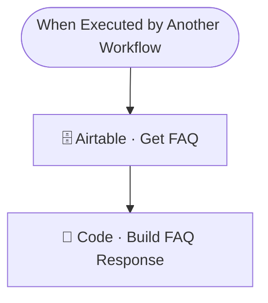

# 🤔❓ SUB · FAQ Lookup

| Campo | Valor |
|---|---|
| **Archivo fuente** | `Workflow/Sub-Worflow/🤔❓ SUB · FAQ Lookup (Rivas Motors- Bajaja Sureste).json` |
| **ID n8n** | `oErm1xnX6IX7qhOO` |
| **Estado** | Activo |
| **Categoría** | Dominio — Tool del Agente Comercial |
| **Nodos** | 3 |
| **Trigger** | `executeWorkflowTrigger`, expuesto como *tool* (`Tool · Consultar FAQ`) |

## 1. Resumen

El sub-workflow más simple del proyecto: consulta la tabla de preguntas frecuentes en Airtable para responder dudas del cliente que **no** están cubiertas por el conocimiento propio del Agente Comercial ni por disponibilidad de inventario. Actúa como respaldo, según indica su propio `description` de tool: *"Usala solo como respaldo si la pregunta no está cubierta en tu conocimiento."*

## 2. Trigger

`executeWorkflowTrigger` — input: `tema`.

## 3. Contrato de datos

### Salida
Respuesta construida a partir de las filas de FAQ que coinciden con el tema consultado.

## 4. Flujo del proceso

1. Busca en la tabla `FAQs` de Airtable.
2. Construye la respuesta a partir de las filas obtenidas.

## 5. Diagrama de flujo (UML)

## 6. Integraciones externas

| Sistema | Uso |
|---|---|
| Airtable | Tabla `FAQs` |

## 7. Relación con otros workflows

- **Invocado por**: `🔶 MAIN`, como tool del Agente Comercial.
- **Invoca a**: ninguno.

## 8. Reglas de negocio y notas técnicas

- Sin cache: al ser la última línea de defensa (respaldo) y de bajo volumen esperado, no justifica la complejidad de cache-aside que sí tienen Inventory/Promos.
