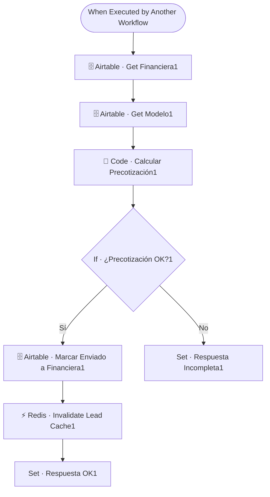

# 🏦 SUB · Calcular Precotización

| Campo | Valor |
|---|---|
| **Archivo fuente** | `Workflow/Sub-Worflow/🏦 SUB ·  Calcular Precotización (Rivas Motors- Bajaja Sureste).json` |
| **ID n8n** | `cYUAv1Wm4qmLsdCv` |
| **Estado** | Activo |
| **Categoría** | Dominio — Tool del Agente Comercial |
| **Nodos** | 17 |
| **Trigger** | `executeWorkflowTrigger`, expuesto como *tool* (`Tool · Calcular Financiamiento`) |

## 1. Resumen

Calcula la mensualidad estimada de un crédito para una moto (enganche + plazo), y marca en el CRM que el lead fue "enviado a financiera" cuando la precotización es válida. Es la herramienta que el agente usa cuando el cliente pregunta "¿a cómo sale?", "mensualidades" o quiere simular un plan de crédito.

## 2. Trigger

`executeWorkflowTrigger` — inputs: `user_id_canal`, `modelo`, `enganche`, `plazo_meses`, entre otros.

## 3. Contrato de datos

### Salida
- Éxito (`Set · Respuesta OK1`): `ok`, `mensaje_agente`, `link`, `mensualidad_estimada`, `plazo_meses`.
- Datos incompletos (`Set · Respuesta Incompleta1`): `ok: false`, `mensaje_agente` explicando qué falta.

## 4. Flujo del proceso

1. Trae la financiera y el modelo desde Airtable.
2. Calcula la precotización (`Code · Calcular Precotización1`) con la lógica de tasas/plazos de la financiera elegida.
3. Si la precotización es válida (`If · ¿Precotización OK?1`): marca el lead como "enviado a financiera" en Airtable, invalida su cache de Redis, y arma la respuesta con la mensualidad estimada.
4. Si no es válida (faltan datos): retorna una respuesta indicando qué información falta, sin tocar el CRM.

## 5. Diagrama de flujo (UML)

## 6. Integraciones externas

| Sistema | Uso |
|---|---|
| Airtable | Tablas `Financieras`, `Modelos`, `Leads` |
| Redis | Invalidación de cache de lead tras el cambio de estado |

## 7. Relación con otros workflows

- **Invocado por**: `🔶 MAIN`, como tool del Agente Comercial.
- **Invoca a**: ninguno (el resultado de la financiera vuelve al sistema, más tarde, vía `🏦 Financiera Inbound`).

## 8. Reglas de negocio y notas técnicas

> ⚠️ **Deuda técnica detectada**: el workflow contiene **dos ramas completas y equivalentes** de la misma lógica de cálculo. La primera (nodos `Airtable · Get Financiera`, `Airtable · Get Modelo`, `Code · Calcular Precotización`, etc., sin sufijo) está **completamente deshabilitada** — todos sus nodos tienen la bandera `disabled: true` en el JSON. Solo la segunda rama (sufijo `1`) está activa y conectada al trigger. La rama deshabilitada parece un remanente de una iteración anterior dejado como referencia/rollback; se recomienda eliminarla si ya no es necesaria, para evitar confusión al mantener el workflow.
