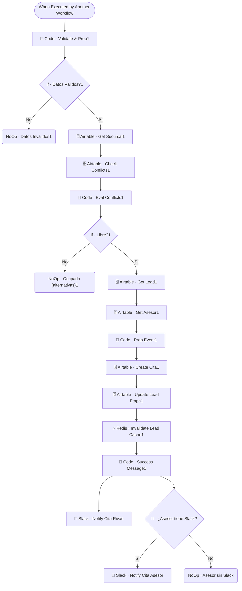

# 🗓️ SUB · Agenda Manager

| Campo | Valor |
|---|---|
| **Archivo fuente** | `Workflow/Sub-Worflow/🗓️ SUB · Agenda Manager (Rivas Motors- Bajaja Sureste).json` |
| **ID n8n** | `v6dh081P1HaiMGau` |
| **Estado** | Activo |
| **Categoría** | Dominio — Tool del Agente Comercial |
| **Nodos** | 20 |
| **Trigger** | `executeWorkflowTrigger`, expuesto como *tool* (`Tool · Agendar Cita`) |

## 1. Resumen

Agenda una cita (prueba de manejo, visita, etc.) validando conflictos de horario contra la sucursal elegida, y notifica al equipo por Slack. Según su propio `description` de tool, debe usarse **solo cuando el cliente ya confirmó tipo, fecha y hora** — no antes.

## 2. Trigger

`executeWorkflowTrigger` — inputs: `user_id_canal`, `lead_id`, `tipo_cita`, `fecha` (YYYY-MM-DD), `hora` (HH:MM), `sucursal_id`.

## 3. Contrato de datos

### Salida
- Datos inválidos: recorte temprano en `NoOp · Datos Inválidos1`.
- Horario ocupado: `NoOp · Ocupado (alternativas)1` (el llamador debe re-preguntar).
- Éxito: mensaje de confirmación construido en `Code · Success Message1`, más notificaciones a Slack.

## 4. Flujo del proceso

1. Valida y normaliza los datos de entrada (`Code · Validate & Prep1` — mapea sinónimos de `tipo_cita`, ej. "prueba" → "Prueba de manejo").
2. Si los datos son válidos, resuelve la sucursal y consulta conflictos de horario en la tabla `Citas`.
3. Si el horario está libre, trae el lead y el asesor asignado, prepara el evento (`Code · Prep Event1`), crea la cita en Airtable, actualiza la etapa del lead e invalida su cache.
4. Construye el mensaje de éxito y notifica por Slack al canal general de la sucursal; si el asesor tiene Slack vinculado, también le manda un DM directo.

## 5. Diagrama de flujo (UML)

## 6. Integraciones externas

| Sistema | Uso |
|---|---|
| Airtable | Tablas `Sucursales`, `Citas`, `Leads`, `Asesores` |
| Redis | Invalidación de cache de lead |
| Slack | Notificación de nueva cita (canal + DM al asesor) |

## 7. Relación con otros workflows

- **Invocado por**: `🔶 MAIN`, como tool del Agente Comercial.
- **Invoca a**: ninguno.

## 8. Reglas de negocio y notas técnicas

- El mapeo de sinónimos de `tipo_cita` en `Code · Validate & Prep1` es la capa que absorbe la variabilidad de cómo el LLM le pasa el parámetro (ej. "prueba" vs. "prueba de manejo" vs. "test drive").
- Cuando el horario está ocupado, el workflow **no propone alternativas automáticamente** — solo señaliza `NoOp · Ocupado (alternativas)1`; la lógica de sugerir un horario distinto queda a cargo del Agente Comercial en su siguiente turno de conversación.
