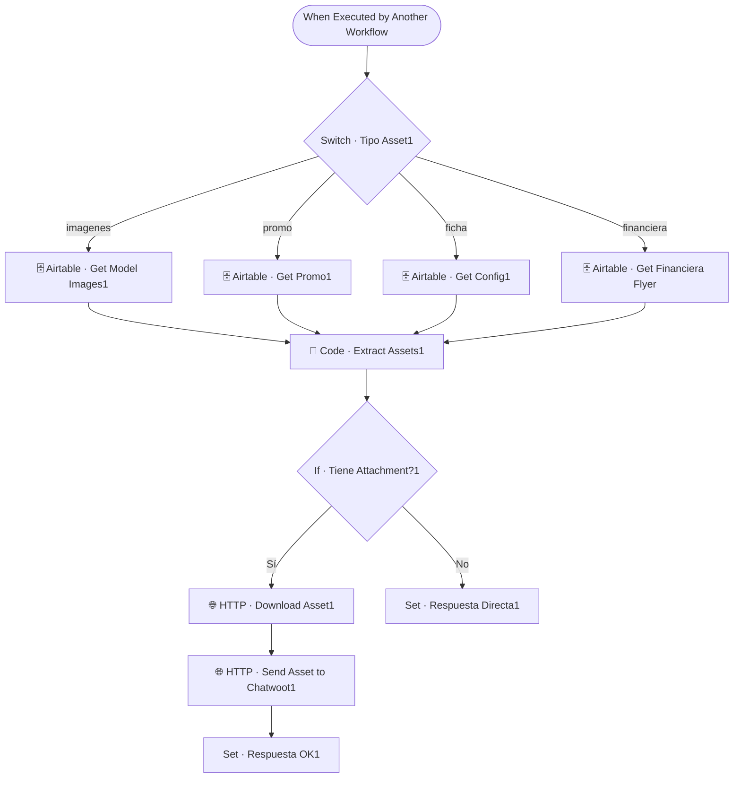

# 📸 SUB · Media Sender

| Campo | Valor |
|---|---|
| **Archivo fuente** | `Workflow/Sub-Worflow/📸 SUB · Media Sender (Rivas Motors- Bajaja Sureste).json` |
| **ID n8n** | `stpHXHqtu61CIrx3` |
| **Estado** | Activo |
| **Categoría** | Dominio — Tool del Agente Comercial |
| **Nodos** | 22 |
| **Trigger** | `executeWorkflowTrigger`, expuesto como *tool* (`Tool · Enviar Fotos`) |

## 1. Resumen

Envía material multimedia al cliente por WhatsApp (vía Chatwoot): fotos del modelo, ficha técnica en PDF, flyer de la promo vigente, o flyer de la financiera. El tipo de asset a enviar lo decide el Agente Comercial mediante el parámetro `tipo`.

## 2. Trigger

`executeWorkflowTrigger` — inputs: `modelo`, `conversation_id`, `tipo` (`imagenes` | `ficha` | `promo` | flyer de financiera).

## 3. Contrato de datos

### Salida
- Con adjunto descargable: `Set · Respuesta OK1` tras reenviarlo a Chatwoot.
- Sin adjunto (solo link): `Set · Respuesta Directa1` con el link directo.

## 4. Flujo del proceso

1. `Switch · Tipo Asset1` decide la fuente según el parámetro `tipo`: imágenes de modelo, promo, ficha técnica (config), o flyer de financiera.
2. Extrae el asset correspondiente (`Code · Extract Assets1`).
3. Si el asset tiene un adjunto descargable, lo descarga y lo reenvía a Chatwoot como archivo; si no, retorna el link directamente.

## 5. Diagrama de flujo (UML)

## 6. Integraciones externas

| Sistema | Uso |
|---|---|
| Airtable | Tablas `Modelos`, `Promociones`, `Config`, `Financieras` |
| Chatwoot (HTTP) | Envío del adjunto/mensaje al cliente |

## 7. Relación con otros workflows

- **Invocado por**: `🔶 MAIN`, como tool del Agente Comercial.
- **Invoca a**: ninguno.

## 8. Reglas de negocio y notas técnicas

> ⚠️ **Deuda técnica detectada**: el workflow tiene **dos ramas paralelas** de la misma lógica (una sin sufijo, otra con sufijo `1`). El nodo trigger conecta exclusivamente a `Switch · Tipo Asset1` (la rama con sufijo), por lo que la rama sin sufijo (`Switch · Tipo Asset`, sin la opción de flyer de financiera) **no es alcanzable** desde ninguna ejecución real — es código muerto que conviene eliminar para evitar mantenimiento duplicado.
