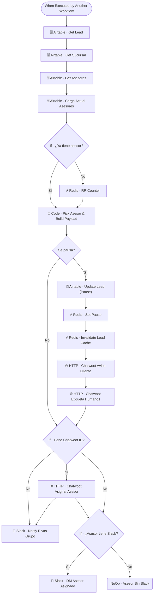

# 👨🏻‍💻 SUB · Human Handoff

| Campo | Valor |
|---|---|
| **Archivo fuente** | `Workflow/Sub-Worflow/👨🏻💻 SUB · Human Handoff (Rivas Motors- Bajaja Sureste).json` |
| **ID n8n** | `3gX1041ty7VwHtWV` |
| **Estado** | Activo |
| **Categoría** | Dominio — Tool del Agente Comercial / Escalamiento |
| **Nodos** | 23 |
| **Trigger** | `executeWorkflowTrigger`, expuesto como *tool* (`Tool · Handoff Asesor`) y también invocado directamente por `MAIN` (ruteo directo) y por `🏦 Financiera Inbound` (tras aprobación) |

## 1. Resumen

Escala la conversación a un asesor humano de la sucursal correspondiente. Si el lead aún no tiene asesor asignado, lo elige por **round-robin ponderado**; en cualquier caso, pausa al bot, notifica al equipo por Slack y avisa al cliente que fue transferido. Según su `description` de tool: *"SIEMPRE perfila antes"* — se espera que el agente ya haya recabado datos mínimos antes de invocar esta herramienta.

## 2. Trigger

`executeWorkflowTrigger` — inputs: `user_id_canal`, `conversation_id`, `sucursal_id`, entre otros.

## 3. Contrato de datos

### Salida
Efectos secundarios (no hay un contrato de retorno rico): lead pausado y asignado en Airtable, notificación en Slack, mensaje de aviso al cliente en Chatwoot.

## 4. Flujo del proceso

1. Trae el lead y resuelve la sucursal/asesores disponibles.
2. Si el lead **ya tiene** asesor asignado, reutiliza ese asesor (`Code · Pick Asesor & Build Payload`); si no, incrementa el contador round-robin en Redis y elige uno nuevo.
3. `Se pausa?` decide si corresponde pausar el bot — si sí, marca el lead en pausa en Airtable, guarda el flag en Redis e invalida su cache.
4. Notifica al cliente vía Chatwoot que fue transferido, etiqueta la conversación como "atendido por humano", y si hay `conversation_id` de Chatwoot, asigna formalmente al asesor en la plataforma.
5. Notifica al canal de Slack del equipo y, si el asesor tiene Slack vinculado, le manda un DM directo con los datos del lead.

## 5. Diagrama de flujo (UML)

## 6. Integraciones externas

| Sistema | Uso |
|---|---|
| Airtable | Tablas `Leads`, `Sucursales`, `Asesores` |
| Redis | Round-robin de asesores, flag de pausa, invalidación de cache |
| Slack | Notificación de canal + DM al asesor asignado |
| Chatwoot (HTTP) | Aviso al cliente, etiquetado, asignación formal del agente en Chatwoot |

## 7. Relación con otros workflows

- **Invocado por**: `🔶 MAIN` (tool del agente y ruteo directo `Execute · Direct Handoff`), y por `🏦 Financiera Inbound` cuando un crédito es aprobado.
- **Invoca a**: ninguno.

## 8. Reglas de negocio y notas técnicas

- Comparte la mecánica de *weighted round-robin* con `👤 Auto-Asignar Asesor` — ambos workflows reimplementan una lógica de asignación muy similar por separado; es candidato a extraer a un sub-workflow común de "asignación de asesor" reutilizado por ambos.
- **Nodos deshabilitados**: existen versiones antiguas deshabilitadas de `HTTP · Chatwoot Etiqueta Humano`, `HTTP · Chatwoot Aviso Cliente1` y `HTTP · Chatwoot Asignar Asesor` (sin sufijo `1`) — reemplazadas por sus versiones activas homónimas. Es limpieza pendiente.
