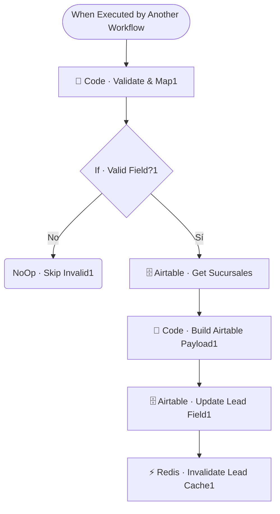

# 📊📉 SUB · CRM Updater

| Campo | Valor |
|---|---|
| **Archivo fuente** | `Workflow/Sub-Worflow/📊📉 SUB · CRM Updater (Rivas Motors - Bjaja Sureste).json` |
| **ID n8n** | `0Jg3uESV26OOvxTR` |
| **Estado** | Activo |
| **Categoría** | Dominio — Tool del Agente Comercial |
| **Nodos** | 8 |
| **Trigger** | `executeWorkflowTrigger`, expuesto como *tool* (`Tool · Actualizar Lead`) |

## 1. Resumen

Permite que el Agente Comercial guarde **en silencio** (sin que el cliente lo note) un dato revelado durante la conversación — nombre, ciudad, colonia, sucursal, email, teléfono, presupuesto, etc. — un campo a la vez, validando que el campo sea escribible antes de tocar Airtable.

## 2. Trigger

`executeWorkflowTrigger` — inputs: `user_id_canal`, `campo`, `valor`, `sucursal_id`.

## 3. Contrato de datos

### Salida
Sin contrato de retorno rico — actualiza Airtable e invalida la cache del lead; campos inválidos se descartan silenciosamente (`NoOp · Skip Invalid1`).

## 4. Flujo del proceso

1. Valida y normaliza el nombre del campo recibido (`Code · Validate & Map1`).
2. Si el campo es válido, resuelve la sucursal (si aplica) y arma el payload de Airtable con **solo** ese campo + `ultima_interaccion`.
3. Actualiza (`upsert`) el lead en Airtable e invalida su cache en Redis.

## 5. Diagrama de flujo (UML)

## 6. Integraciones externas

| Sistema | Uso |
|---|---|
| Airtable | Tablas `Leads`, `Sucursales` |
| Redis | Invalidación de cache de lead |

## 7. Relación con otros workflows

- **Invocado por**: `🔶 MAIN`, como tool del Agente Comercial. Su `description` original indica: *"Una llamada por dato"* — el agente debe invocarlo una vez por cada campo individual, no en lote.
- **Invoca a**: ninguno.

## 8. Reglas de negocio y notas técnicas

- La validación de "campo válido" (`Code · Validate & Map1`) es el único guardarraíl contra que el LLM intente escribir en un campo arbitrario del CRM — es la pieza de seguridad más importante de este workflow.
