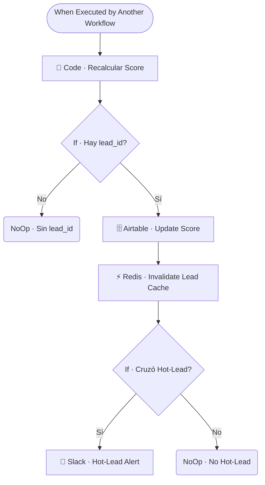

# 🥇🥈🏅 SUB · Lead Scorer

| Campo | Valor |
|---|---|
| **Archivo fuente** | `Workflow/Sub-Worflow/🥇🥈🏅 SUB · Lead Scorer (Rivas Motors- Bajaja Sureste).json` |
| **ID n8n** | `wxBV0OjNCCRdf0j0` |
| **Estado** | Activo |
| **Categoría** | Dominio — Post-proceso |
| **Nodos** | 9 |
| **Trigger** | `executeWorkflowTrigger` (invocado por `MAIN` tras cada respuesta del agente) |

## 1. Resumen

Recalcula el score del lead usando un sistema de **pesos por señal de intención** (ej. `pide_prueba_manejo: 20`, `pide_cita_visita: 18`, `quiere_apartar_con_enganche: ...`), y alerta al equipo comercial por Slack cuando el lead cruza el umbral de "hot lead".

## 2. Trigger

`executeWorkflowTrigger` — inputs: `user_id_canal`, `lead_id`, `current_score`, una o más `new_signal`.

## 3. Contrato de datos

### Salida
Sin retorno rico — actualiza `lead_score` en Airtable, invalida la cache del lead, y dispara una alerta de Slack si corresponde.

## 4. Flujo del proceso

1. Recalcula el score sumando los pesos de las señales nuevas al score actual (`Code · Recalcular Score`).
2. Si hay `lead_id`, actualiza el score en Airtable e invalida la cache.
3. Si el nuevo score cruza el umbral de "hot lead" (y no lo había cruzado antes), envía una alerta al canal de Slack de ventas.

## 5. Diagrama de flujo (UML)

## 6. Integraciones externas

| Sistema | Uso |
|---|---|
| Airtable | Tabla `Leads` |
| Redis | Invalidación de cache de lead |
| Slack | Alerta de hot-lead al equipo de ventas |

## 7. Relación con otros workflows

- **Invocado por**: `🔶 MAIN`, al final de cada turno de conversación (post-respuesta).
- **Invoca a**: ninguno.

## 8. Reglas de negocio y notas técnicas

- El sistema de pesos (`PESOS` en `Code · Recalcular Score`) es la definición central de qué comportamientos del cliente valen más para priorización comercial — cualquier cambio en la estrategia de calificación de leads debe hacerse aquí.
- La alerta de hot-lead se dispara **solo al cruzar** el umbral, no en cada actualización — evita spam de Slack para leads que ya eran hot-lead.
