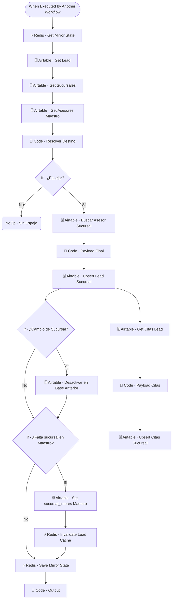

# 🪞 SUB · CRM Sucursal Mirror

| Campo | Valor |
|---|---|
| **Archivo fuente** | `Workflow/Sub-Worflow/🪞 SUB · CRM Sucursal Mirror (Rivas Motors - Bajaj Sureste).json` |
| **ID n8n** | `hlZ53Wve9BkLMN6F` |
| **Estado** | Activo |
| **Categoría** | Dominio — Post-proceso / Sincronización de CRM |
| **Nodos** | 21 |
| **Trigger** | `executeWorkflowTrigger` (invocado por `MAIN` tras cada respuesta del agente) |

## 1. Resumen

Implementa la arquitectura de **CRM maestro + espejos**: el maestro (`CRM Rivas Motors`) es la fuente de verdad, y este workflow resuelve a qué **base de Airtable de sucursal** pertenece el lead, replicando (`upsert`) tanto el lead como sus citas hacia esa base. Si el lead cambió de sucursal desde el último espejo, desactiva el registro en la base anterior.

## 2. Trigger

`executeWorkflowTrigger` — inputs: `user_id_canal`, `sucursal_id_hint`, `ciudad_hint`.

## 3. Contrato de datos

### Salida
`Code · Output`: `{ ok: true, espejado_en, sucursal_id, via }` — confirmación de en qué base quedó espejado el lead y por qué mecanismo se resolvió el destino.

## 4. Flujo del proceso

1. Consulta el estado del último espejo en Redis (`mirror:lead:{id}`).
2. Trae el lead del CRM maestro, el catálogo de sucursales y de asesores maestro.
3. `Code · Resolver Destino` decide a qué base de sucursal corresponde el lead (usando `sucursal_id_hint`, `ciudad_hint` o los datos ya guardados del lead).
4. Si corresponde espejar, busca el asesor equivalente en la base destino, arma el payload final (solo columnas espejables) y hace `upsert` del lead ahí.
5. Si el lead cambió de sucursal respecto al espejo anterior, desactiva el registro en la base anterior; si el maestro no tenía `sucursal_interes` seteada, la completa con el resultado de la resolución.
6. Espeja también las citas del lead (`Citas`) hacia la base de sucursal, e invalida cache/guarda el nuevo estado del espejo en Redis.

## 5. Diagrama de flujo (UML)

## 6. Integraciones externas

| Sistema | Uso |
|---|---|
| Airtable | Base maestro `CRM Rivas Motors` + N bases de sucursal (`Leads`, `Sucursales`, `Asesores`, `Citas`) |
| Redis | Estado del espejo (`mirror:lead:{id}`), invalidación de cache |

## 7. Relación con otros workflows

- **Invocado por**: `🔶 MAIN`, en cadena tras `🥇 Lead Scorer`, antes de `👤 Auto-Asignar Asesor`.
- **Invoca a**: ninguno.

## 8. Reglas de negocio y notas técnicas

- El "maestro" (`CRM Rivas Motors`) es siempre la fuente de verdad; las bases de sucursal son solo espejos de lectura para el equipo local — cualquier escritura directa en una base de sucursal fuera de este mecanismo generará divergencia.
- Comparte casi toda su estructura con `🪞 CRM Region Mirror` (ver ese documento) — son el mismo patrón aplicado a dos niveles de granularidad geográfica distintos (sucursal vs. región).
