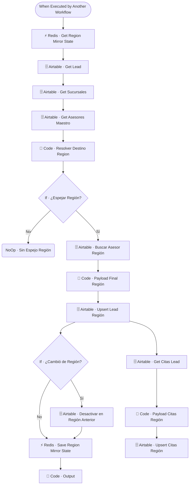

# 🪞 SUB · CRM Region Mirror

| Campo | Valor |
|---|---|
| **Archivo fuente** | `Workflow/Sub-Worflow/🪞 SUB · CRM Region Mirror (Rivas Motors - Bajaj Sureste).json` |
| **ID n8n** | `CPlentnVnRZHVDXN` |
| **Estado** | Activo |
| **Categoría** | Dominio — Post-proceso / Sincronización de CRM |
| **Nodos** | 18 |
| **Trigger** | `executeWorkflowTrigger` (invocado por `MAIN` tras cada respuesta del agente) |

## 1. Resumen

Análogo a `🪞 CRM Sucursal Mirror`, pero a nivel de **región** en lugar de sucursal individual: replica el lead y sus citas hacia la base de Airtable de la región correspondiente, y desactiva el registro en la región anterior si el lead cambió de región.

## 2. Trigger

`executeWorkflowTrigger` — inputs: `user_id_canal`, `sucursal_id_hint`, `ciudad_hint`.

## 3. Contrato de datos

### Salida
`Code · Output`: `{ ok: true, espejado_en, sucursal_id, via }`.

## 4. Flujo del proceso

Idéntico en estructura a `CRM Sucursal Mirror`: obtiene estado de espejo, lead, sucursales y asesores maestro → resuelve destino regional → si aplica, espeja el lead y sus citas en la base de la región → si cambió de región, desactiva el registro anterior → guarda el nuevo estado del espejo.

## 5. Diagrama de flujo (UML)

## 6. Integraciones externas

| Sistema | Uso |
|---|---|
| Airtable | Base maestro `CRM Rivas Motors` + bases regionales (`Leads`, `Sucursales`, `Asesores`, `Citas`) |
| Redis | Estado del espejo (`mirror:region:lead:{id}`) |

## 7. Relación con otros workflows

- **Invocado por**: `🔶 MAIN`, en paralelo con `🪞 CRM Sucursal Mirror` tras `🥇 Lead Scorer`.
- **Invoca a**: ninguno.

## 8. Reglas de negocio y notas técnicas

- A diferencia de `CRM Sucursal Mirror`, este workflow **no** tiene el paso de "completar `sucursal_interes` en el maestro si falta" — es una asimetría entre ambos mirrors que conviene revisar: si es intencional, documentarla; si es un olvido, replicar la lógica.
