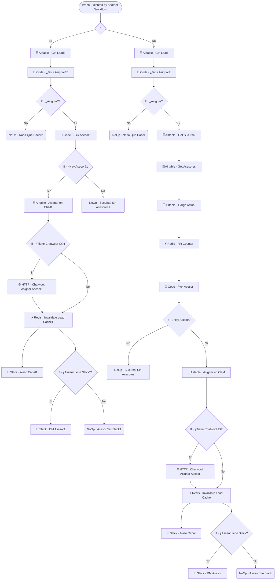

# 👤 SUB · Auto-Asignar Asesor

| Campo | Valor |
|---|---|
| **Archivo fuente** | `Workflow/Sub-Worflow/👤 SUB · Auto-Asignar Asesor (Rivas Motors - Bajaj Sureste).json` |
| **ID n8n** | `dUn3tE94kamW53Gi` |
| **Estado** | Activo |
| **Categoría** | Dominio — Post-proceso / Asignación |
| **Nodos** | 41 |
| **Trigger** | `executeWorkflowTrigger` (invocado por `MAIN` tras `CRM Sucursal Mirror`) |

## 1. Resumen

Asigna automáticamente un asesor a un lead que aún no tiene uno, usando **round-robin ponderado con overflow multi-sucursal**, disparado proactivamente tras cada interacción — a diferencia de `👨‍💻 Human Handoff`, que asigna a petición explícita del flujo de escalamiento.

## 2. Trigger

`executeWorkflowTrigger` — inputs: `user_id_canal`, `conversation_id`.

## 3. Contrato de datos

### Salida
Sin retorno rico — efectos secundarios: asignación en Airtable, asignación formal en Chatwoot, notificaciones de Slack.

## 4. Flujo del proceso

> ⚠️ Ver nota técnica en la sección 8: este workflow contiene **tres variantes casi idénticas** de la misma lógica de guard + asignación, encadenadas por un nodo `If` inicial. Se documenta la cadena de ejecución real.

1. Un nodo `If` inicial decide entre dos caminos de entrada (variante "Lead3" o variante "Lead" original).
2. Cada variante repite el mismo patrón: trae el lead → `Code · ¿Toca Asignar?` (guard idempotente que evalúa si el lead cumple condiciones para asignación, sin usar banderas explícitas, sino el estado real del CRM) → si aplica, continúa a la asignación.
3. La asignación en sí (variante activa: cache de asesores en Redis + `Code · Pick Asesor1`, weighted random con overflow entre sucursales) elige un asesor, lo asigna en Airtable, lo asigna formalmente en Chatwoot (si hay `conversation_id`), invalida cache y notifica por Slack (canal general + DM si el asesor tiene Slack).

## 5. Diagrama de flujo (UML)

## 6. Integraciones externas

| Sistema | Uso |
|---|---|
| Airtable | Tablas `Leads`, `Sucursales`, `Asesores` |
| Redis | Cache de asesores (`asesores:cache`), contador round-robin |
| Slack | Notificación de canal + DM al asesor |
| Chatwoot (HTTP) | Asignación formal del agente en la conversación |

## 7. Relación con otros workflows

- **Invocado por**: `🔶 MAIN`, inmediatamente después de `🪞 CRM Sucursal Mirror`.
- **Invoca a**: ninguno.
- Depende de la cache `asesores:cache` poblada por `SYNC · Asesores → Redis`.

## 8. Reglas de negocio y notas técnicas

> ⚠️ **Deuda técnica detectada**: este es el workflow con más señales de iteración incremental sin limpieza del proyecto — coexisten **tres variantes** del mismo guard "¿toca asignar?" y del picker de asesor (sufijos vacío, `1`, `3`), encadenadas por un `If` inicial poco descriptivo (nombrado literalmente `"If"`). Se recomienda: (1) determinar cuál variante es la "canónica" actualmente en uso según el valor real que evalúa `If`, (2) eliminar las variantes no alcanzables, y (3) renombrar el nodo `If` inicial a algo descriptivo del criterio que evalúa.
- Comparte la mecánica de asignación ponderada con `👨‍💻 Human Handoff` — ver nota de duplicación en ese documento.
