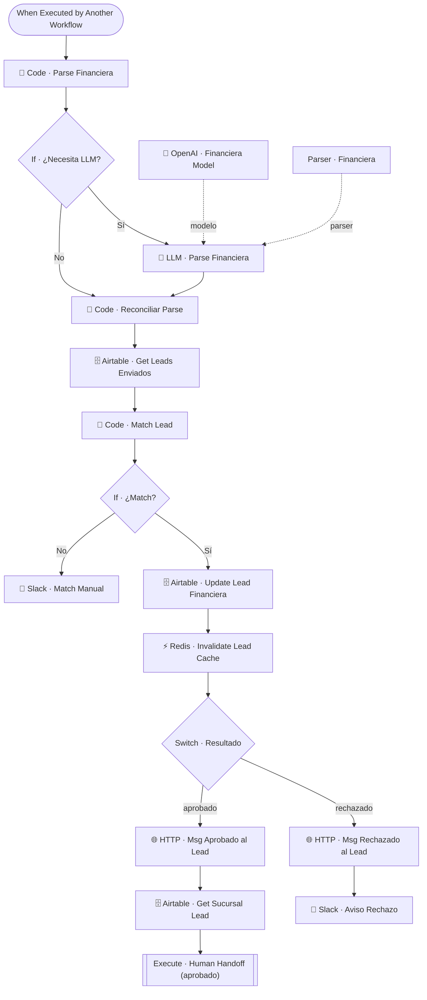

# 🏦 SUB · Financiera Inbound

| Campo | Valor |
|---|---|
| **Archivo fuente** | `Workflow/Sub-Worflow/🏦 SUB · Financiera Inbound (Rivas Motors- Bajaja Sureste).json` |
| **ID n8n** | `CmqXcw91UDHy8yT7` |
| **Estado** | Activo |
| **Categoría** | Dominio — Integración externa |
| **Nodos** | 19 |
| **Trigger** | `executeWorkflowTrigger` (invocado por `MAIN` cuando el remitente es identificado como la financiera) |

## 1. Resumen

Procesa los mensajes que el bot/agente de la **financiera externa** manda de vuelta por WhatsApp (aprobación o rechazo de una solicitud de crédito), hace *match* contra los leads previamente enviados a financiera, y notifica al cliente final del resultado — con handoff a asesor humano si fue aprobado, o aviso a Slack si fue rechazado o no se pudo emparejar automáticamente.

## 2. Trigger

`executeWorkflowTrigger` — inputs: `financiera_user_id`, `message_text`, `conversation_id_financiera`, entre otros.

## 3. Contrato de datos

### Salida
Sin retorno rico al llamador (MAIN no espera respuesta) — efectos secundarios: actualización del lead en Airtable, mensaje al cliente vía Chatwoot, notificación a Slack, e invocación de `Human Handoff` si aplica.

## 4. Flujo del proceso

1. Parsea el mensaje crudo de la financiera con reglas determinísticas (`Code · Parse Financiera`).
2. Si el formato es ambiguo (`If · ¿Necesita LLM?`), delega a un LLM (`LLM · Parse Financiera`) para extraer nombre, teléfono y estado de la solicitud.
3. Reconcilia el resultado (determinístico o LLM) en un solo objeto (`Code · Reconciliar Parse`).
4. Busca entre los leads previamente enviados a financiera y trata de emparejar por teléfono (`Code · Match Lead`).
5. **Sin match**: notifica a Slack para intervención manual (`Slack · Match Manual`).
6. **Con match**: actualiza el estado financiero del lead en Airtable, invalida su cache, y según el resultado:
   - **Aprobado**: avisa al cliente vía Chatwoot y dispara `👨‍💻 Human Handoff` para que un asesor dé seguimiento al cierre.
   - **Rechazado**: avisa al cliente vía Chatwoot y notifica a Slack.

## 5. Diagrama de flujo (UML)

## 6. Integraciones externas

| Sistema | Uso |
|---|---|
| Airtable | Tablas `Leads`, `Sucursales` |
| OpenAI | Interpretación de mensajes con formato variable (fallback) |
| Slack | Match manual + aviso de rechazo |
| Chatwoot (HTTP) | Mensajes al cliente final |
| Redis | Invalidación de cache de lead |

## 7. Relación con otros workflows

- **Invocado por**: `🔶 MAIN`, mediante un ruteo temprano (`If · ¿Es la Financiera?`) que ocurre **antes** de la normalización de tipo de mensaje.
- **Invoca a**: `👨‍💻 Human Handoff` (solo en el caso de aprobación).

## 8. Reglas de negocio y notas técnicas

- Comparte el patrón **reglas-primero, LLM-como-respaldo** con `📍 Geo Router` — es la segunda ocurrencia de esta convención de diseño en el proyecto.
- El match por teléfono es el punto único de fallo de este flujo: si el bot de la financiera cambia su formato de número (con/sin código de país, con/sin espacios), el `Code · Match Lead` debe normalizar ambos lados de la comparación — cualquier bug aquí termina como una fila más en "Match Manual" de Slack, no como un error silencioso.
