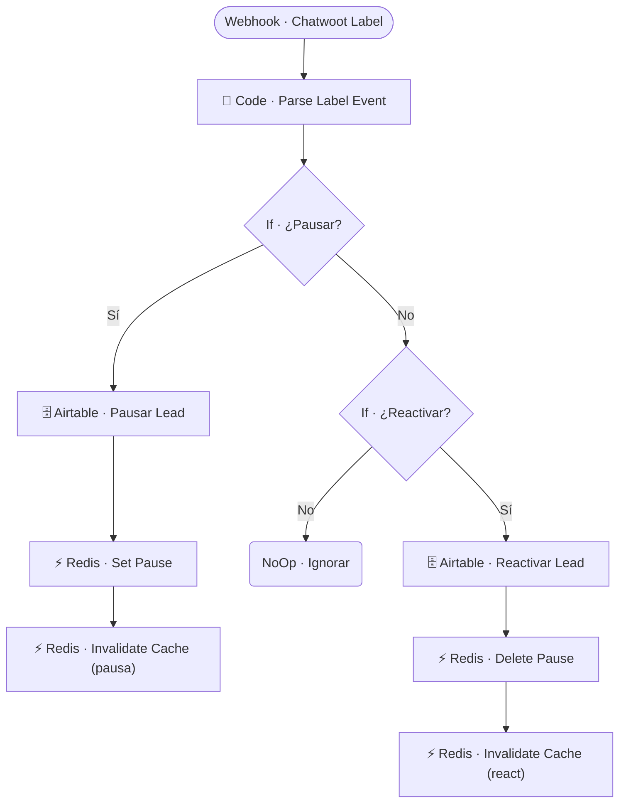

# 🏷️ SUB · Chatwoot Label Control

| Campo | Valor |
|---|---|
| **Archivo fuente** | `Workflow/Sub-Worflow/🏷️ SUB · Chatwoot Label Control (Rivas Motors - Bajaj Sureste).json` |
| **ID n8n** | `TgwJdU3ckxGq05nN` |
| **Estado** | Activo |
| **Categoría** | Webhook independiente — Control manual del bot |
| **Nodos** | 11 |
| **Trigger** | `Webhook · Chatwoot Label` — `POST /rivasmotors-chatwoot-label` |

## 1. Resumen

Escucha el evento de Chatwoot cuando un agente humano **agrega o quita una etiqueta** a una conversación, y usa eso como mecanismo de **control manual** de pausa/reactivación del bot — complementario al control automático que hace `MAIN` cuando detecta que un asesor escribió.

## 2. Trigger

`n8n-nodes-base.webhook` — `POST /rivasmotors-chatwoot-label`, configurado como webhook de eventos de etiquetado de Chatwoot.

## 3. Contrato de datos

### Entrada
Payload de Chatwoot con la etiqueta añadida/removida y el `user_id_canal` del contacto de la conversación.

### Salida
Sin retorno (webhook fire-and-forget) — efecto: lead pausado o reactivado en Airtable + Redis.

## 4. Flujo del proceso

1. Parsea el evento de etiquetado (`Code · Parse Label Event`).
2. Si la etiqueta corresponde a "pausar", marca el lead como pausado en Airtable, setea el flag en Redis e invalida su cache.
3. Si corresponde a "reactivar", revierte esos mismos flags.
4. Cualquier otra etiqueta se ignora.

## 5. Diagrama de flujo (UML)

## 6. Integraciones externas

| Sistema | Uso |
|---|---|
| Airtable | Tabla `Leads` |
| Redis | Flag de pausa + invalidación de cache |

## 7. Relación con otros workflows

- **Invocado por**: Chatwoot directamente (webhook), no por otro workflow del proyecto.
- **Invoca a**: ninguno.
- Complementa el control de pausa que hace `🔶 MAIN` automáticamente y el que hace `🔄 Chatwoot Reactivar Bot` al resolver la conversación.

## 8. Reglas de negocio y notas técnicas

- Este es uno de **tres mecanismos independientes** para pausar/reactivar el bot en el proyecto: (1) detección automática en `MAIN` cuando un asesor escribe, (2) este control manual por etiqueta, y (3) `Chatwoot Reactivar Bot` al resolver la conversación. Conviene tener presente los tres al depurar un caso de "el bot no responde" o "el bot respondió cuando no debía".
