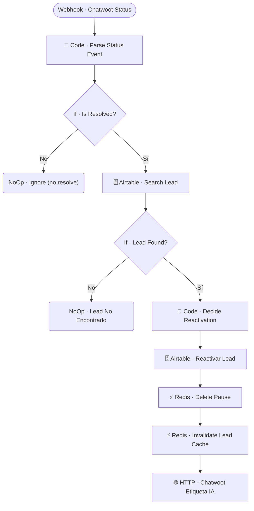

# 🔄 SUB · Chatwoot Reactivar Bot

| Campo | Valor |
|---|---|
| **Archivo fuente** | `Workflow/Sub-Worflow/🔄 SUB · Chatwoot Reactivar Bot (Rivas Motors - Bajaj Sureste).json` |
| **ID n8n** | `2XhNNnW98PiTQWrM` |
| **Estado** | Activo |
| **Categoría** | Webhook independiente — Control automático del bot |
| **Nodos** | 12 |
| **Trigger** | `Webhook · Chatwoot Status` — `POST /rivasmotors-chatwoot-resolve` |

## 1. Resumen

Escucha el evento `conversation_status_changed` de Chatwoot; cuando un asesor **resuelve** la conversación (la marca como cerrada), reactiva automáticamente al bot para ese lead y decide qué campos de reactivación aplicar según la etapa actual del lead. También etiqueta la conversación como "IA" en Chatwoot para señalizar visualmente que el bot retomó el control.

## 2. Trigger

`n8n-nodes-base.webhook` — `POST /rivasmotors-chatwoot-resolve`.

## 3. Contrato de datos

### Entrada
Payload de Chatwoot con el nuevo estado de la conversación y el `user_id_canal` asociado.

### Salida
Sin retorno — efecto: lead reactivado en Airtable, pausa eliminada en Redis, etiqueta "IA" añadida en Chatwoot.

## 4. Flujo del proceso

1. Parsea el evento de cambio de estado (`Code · Parse Status Event`).
2. Si el nuevo estado **no** es "resuelto", ignora el evento.
3. Si es "resuelto", busca el lead en Airtable; si no se encuentra, no hace nada más.
4. Si se encuentra, decide los campos de reactivación según la etapa actual del lead (`Code · Decide Reactivation`), actualiza el lead en Airtable, elimina la pausa de Redis, invalida su cache, y etiqueta la conversación en Chatwoot como atendida por IA.

## 5. Diagrama de flujo (UML)

## 6. Integraciones externas

| Sistema | Uso |
|---|---|
| Airtable | Tabla `Leads` |
| Redis | Eliminación de pausa + invalidación de cache |
| Chatwoot (HTTP) | Etiquetado de la conversación como atendida por IA |

## 7. Relación con otros workflows

- **Invocado por**: Chatwoot directamente (webhook).
- **Invoca a**: ninguno.

## 8. Reglas de negocio y notas técnicas

- Ver nota en `🏷️ Chatwoot Label Control`: este es el segundo de tres mecanismos de pausa/reactivación del bot en el proyecto — este se dispara específicamente al **resolver** la conversación (cierre formal), no al simple etiquetado.
