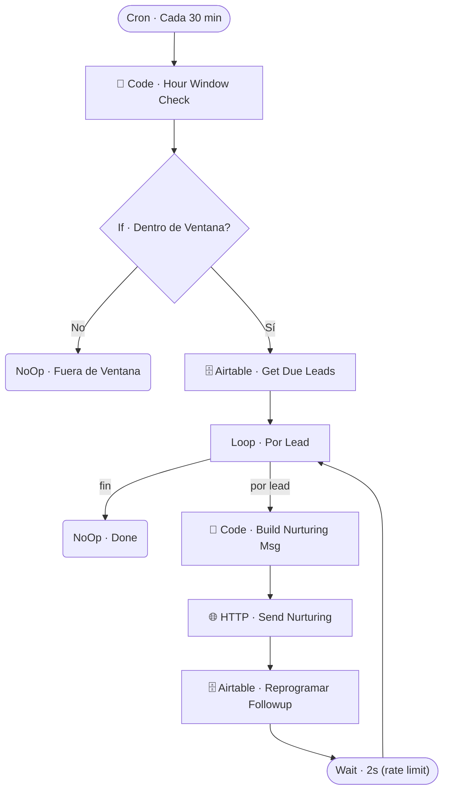

# ⏰ CRON · Nurturing 14d

| Campo | Valor |
|---|---|
| **Archivo fuente** | `Workflow/Sub-Worflow/⏰ CRON · Nurturing 14d (Rivas Motors - Bajaj Sureste).json` |
| **ID n8n** | `Qvqkt1UtRH9fLC2z` |
| **Estado** | **Inactivo** |
| **Categoría** | Programado (Cron) — Reenganche de leads |
| **Nodos** | 11 |
| **Trigger** | `scheduleTrigger` cada 30 minutos |

## 1. Resumen

Reengancha leads fríos con mensajes de seguimiento automáticos, respetando una ventana horaria (9–21h hora de Mérida) para no enviar mensajes de madrugada. Actualmente **desactivado** en el proyecto.

## 2. Trigger

`scheduleTrigger` — cada 30 minutos.

## 3. Contrato de datos

Sin trigger externo con inputs — opera sobre los leads que Airtable marca como "due" para nurturing (`Airtable · Get Due Leads`).

## 4. Flujo del proceso

1. Verifica si la hora actual cae dentro de la ventana permitida (9–21h Mérida).
2. Si está fuera de ventana, no hace nada.
3. Si está dentro, trae los leads pendientes de reenganche e itera uno por uno (`Loop · Por Lead`), enviando un mensaje de nurturing (cuyo contenido varía según el número de ciclo ya enviado), reprogramando el siguiente followup, y respetando un rate-limit de 2 segundos entre envíos.

## 5. Diagrama de flujo (UML)

## 6. Integraciones externas

| Sistema | Uso |
|---|---|
| Airtable | Tabla `Leads` (lectura de pendientes + reprogramación) |
| Chatwoot (HTTP) | Envío del mensaje de nurturing |

## 7. Relación con otros workflows

- **Invocado por**: nadie (trigger propio de cron).
- **Invoca a**: ninguno.

## 8. Reglas de negocio y notas técnicas

- **Workflow inactivo**: si se reactiva, verificar primero que el contenido de los mensajes de nurturing (`Code · Build Nurturing Msg`) siga vigente respecto a modelos/promos actuales antes de dejarlo corriendo en producción.
