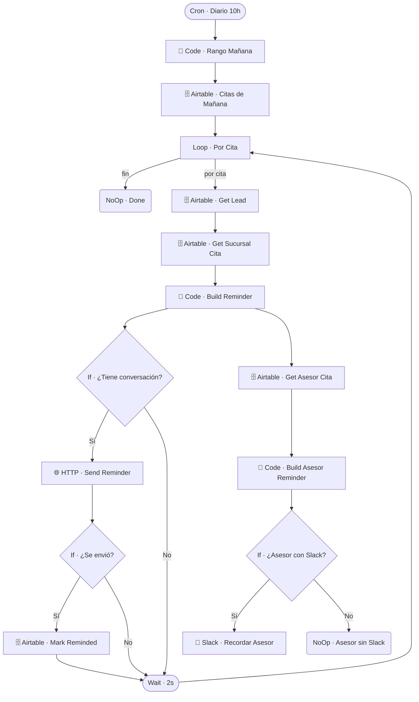

# ⏰ CRON · Recordatorio de Cita

| Campo | Valor |
|---|---|
| **Archivo fuente** | `Workflow/Sub-Worflow/⏰ CRON · Recordatorio de Cita (Rivas Motors- Bajaja Sureste).json` |
| **ID n8n** | `6dOfXrqqWwX7d5Le` |
| **Estado** | Activo |
| **Categoría** | Programado (Cron) — Recordatorios |
| **Nodos** | 18 |
| **Trigger** | `scheduleTrigger` diario a las 10h |

## 1. Resumen

Recuerda a los clientes con citas agendadas para el día siguiente, y avisa por Slack al asesor asignado (si tiene Slack vinculado) para que también lo tenga presente.

## 2. Trigger

`scheduleTrigger` — diario a las 10:00.

## 3. Contrato de datos

Sin trigger externo con inputs — opera sobre la tabla `Citas` de Airtable filtrando por el rango del día siguiente.

## 4. Flujo del proceso

1. Calcula el rango de fecha de "mañana" y trae las citas de ese rango.
2. Itera cita por cita (`Loop · Por Cita`): trae el lead y la sucursal de la cita, construye el mensaje de recordatorio.
3. Si la cita tiene una conversación de Chatwoot asociada, envía el recordatorio al cliente y marca la cita como recordada.
4. En paralelo, trae al asesor de la cita y construye un recordatorio para él; si tiene Slack vinculado, se lo envía por DM.
5. Rate-limit de 2 segundos entre citas.

## 5. Diagrama de flujo (UML)

## 6. Integraciones externas

| Sistema | Uso |
|---|---|
| Airtable | Tablas `Citas`, `Leads`, `Sucursales`, `Asesores` |
| Chatwoot (HTTP) | Envío del recordatorio al cliente |
| Slack | Recordatorio al asesor |

## 7. Relación con otros workflows

- **Invocado por**: nadie (trigger propio de cron).
- **Invoca a**: ninguno.

## 8. Reglas de negocio y notas técnicas

- El recordatorio al cliente depende de que la cita tenga una conversación de Chatwoot activa asociada (`If · ¿Tiene conversación?`) — citas creadas sin ese vínculo (ej. agendadas manualmente en Airtable) no reciben recordatorio automático al cliente, aunque sí se le recuerda al asesor.
