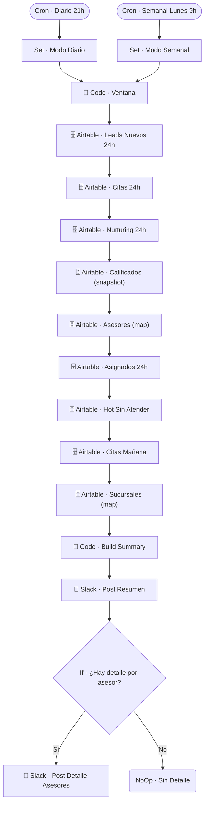

# ⏰ CRON · Resumen Diario

| Campo | Valor |
|---|---|
| **Archivo fuente** | `Workflow/Sub-Worflow/⏰ CRON · Resumen Diario (Rivas Motors- Bajaja Sureste).json` |
| **ID n8n** | `tCDelpdowE8x6p7v` |
| **Estado** | **Inactivo** (todos los nodos deshabilitados) |
| **Categoría** | Programado (Cron) — Reporting |
| **Nodos** | 19 |
| **Trigger** | Dos `scheduleTrigger`: diario a las 21h y semanal (lunes 9h) |

## 1. Resumen

Publica en Slack un resumen ejecutivo de la operación: leads nuevos, citas, calificados, hot leads sin atender y detalle de asignación por asesor — en modo diario o semanal según cuál de los dos triggers lo disparó. **Todos los nodos del workflow están deshabilitados** actualmente.

## 2. Trigger

Dos `scheduleTrigger` independientes: diario a las 21:00, y semanal los lunes a las 9:00 (probablemente para un resumen de cierre de semana con promedios diarios).

## 3. Contrato de datos

Sin trigger externo con inputs — agrega datos de múltiples tablas de Airtable según la ventana de tiempo (`Code · Ventana`, que escala el rango según el modo diario/semanal).

## 4. Flujo del proceso

1. Cada trigger fija el modo (`Set · Modo Diario` / `Set · Modo Semanal`).
2. `Code · Ventana` calcula el rango de fechas correspondiente.
3. Se agregan datos de: leads nuevos, citas, nurturing enviado, calificados (snapshot), asesores, asignados, hot leads sin atender, citas de mañana y sucursales.
4. `Code · Build Summary` arma el texto del resumen y lo publica en Slack.
5. Si hay detalle por asesor disponible, se publica un segundo mensaje con ese desglose.

## 5. Diagrama de flujo (UML)

## 6. Integraciones externas

| Sistema | Uso |
|---|---|
| Airtable | Múltiples tablas (`Leads`, `Citas`, `Asesores`, `Sucursales`) |
| Slack | Publicación del resumen ejecutivo |

## 7. Relación con otros workflows

- **Invocado por**: nadie (trigger propio de cron).
- **Invoca a**: ninguno.

## 8. Reglas de negocio y notas técnicas

- **Workflow completamente deshabilitado**: si se reactiva, revisar que los nombres de campos/vistas de Airtable referenciados sigan vigentes, ya que el resto del CRM ha evolucionado desde que este workflow se desactivó.
