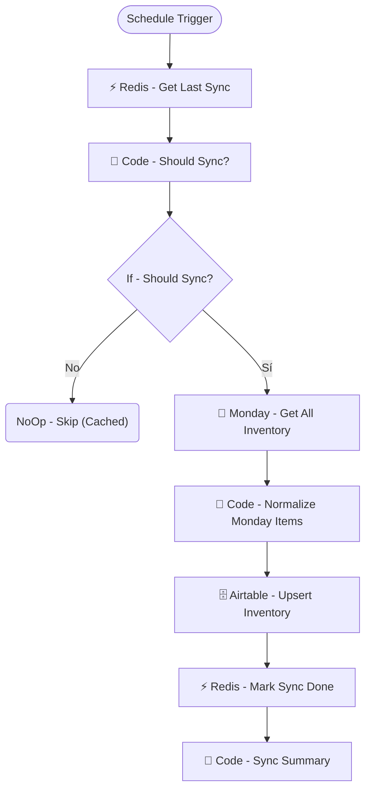

# SUB · Sync Monday to Airtable Inventario

| Campo | Valor |
|---|---|
| **Archivo fuente** | `Workflow/Sub-Worflow/SUB · Sync Monday to Airtable Inventario (Rivas Motors - Bajaj Sureste).json` |
| **ID n8n** | `pe3buoiddO25QNqo` |
| **Estado** | Activo |
| **Categoría** | Programado (Cron) — Sincronización de datos maestros |
| **Nodos** | 10 |
| **Trigger** | `scheduleTrigger` cada 10 horas |

## 1. Resumen

Sincroniza el inventario de motos desde el tablero de **Monday.com** (donde el equipo de inventario lo mantiene actualizado) hacia la tabla `Inventario` de Airtable (fuente de verdad que consume el chatbot). Incluye una cache de 2 minutos en Redis para evitar sincronizaciones redundantes si se dispara manualmente en paralelo al cron.

## 2. Trigger

`scheduleTrigger` — cada 10 horas.

## 3. Contrato de datos

Sin trigger externo con inputs — lee el tablero completo de Monday.com (`boardId: 8890701888`).

## 4. Flujo del proceso

1. Verifica en Redis si ya hubo un sync reciente (`sync:monday:last`, ventana de 2 minutos).
2. Si corresponde sincronizar, trae todos los items del tablero de Monday.com.
3. Normaliza los items a registros planos (`Code · Normalize Monday Items` — incluye un mapeo de nombres de sucursal Monday → Airtable).
4. Hace `upsert` en la tabla `Inventario` de Airtable.
5. Marca el sync como hecho en Redis y arma un resumen para quien haya disparado el workflow.

## 5. Diagrama de flujo (UML)

## 6. Integraciones externas

| Sistema | Uso |
|---|---|
| Monday.com | Origen de verdad del inventario (mantenido manualmente por el equipo) |
| Airtable | Tabla `Inventario` (destino de la sincronización) |
| Redis | Cache anti-spam de sync (`sync:monday:last`) |

## 7. Relación con otros workflows

- **Invocado por**: nadie (trigger propio de cron); el `SUCURSAL_MAP` interno sugiere que también podría dispararse manualmente.
- **Invoca a**: ninguno. Alimenta indirectamente a `🗃️ Inventory Lookup` y `🗂️ Inventory Overview`, que leen de la misma tabla `Inventario`.

## 8. Reglas de negocio y notas técnicas

- El mapeo `SUCURSAL_MAP` (nombres de sucursal en Monday vs. Airtable) es un punto de fragilidad: si se agrega una sucursal nueva en Monday sin actualizar este mapeo, sus items no se normalizarán correctamente.
- La cache de 2 minutos es corta a propósito — su función es solo evitar sync duplicado por ejecuciones casi simultáneas, no reemplazar la cadencia real de 10h del cron.
