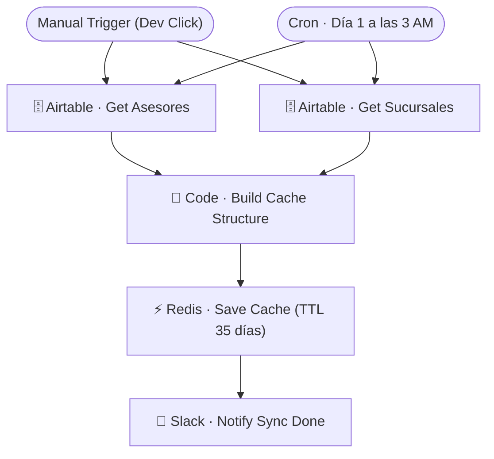

# SYNC · Asesores → Redis

| Campo | Valor |
|---|---|
| **Archivo fuente** | `Workflow/Sub-Worflow/SYNC · Asesores → Redis (Rivas Motors).json` |
| **ID n8n** | `D2kuAgnHldRkDKwq` |
| **Estado** | Activo |
| **Categoría** | Programado (Cron) — Sincronización de datos maestros |
| **Nodos** | 7 |
| **Trigger** | `manualTrigger` (desarrollo) + `scheduleTrigger` mensual (día 1, 3 AM) |

## 1. Resumen

Reconstruye la cache en Redis de asesores agrupados por sucursal, con sus pesos/primarios para el mecanismo de **round-robin ponderado** que usan `👤 Auto-Asignar Asesor` y `👨‍💻 Human Handoff`. Se ejecuta mensualmente porque la planta de asesores cambia con poca frecuencia.

## 2. Trigger

`n8n-nodes-base.manualTrigger` (para pruebas de desarrollo) + `scheduleTrigger` — mensual, día 1 a las 3:00 AM.

## 3. Contrato de datos

Sin trigger externo con inputs — lee íntegramente las tablas `Asesores` y `Sucursales` de Airtable.

## 4. Flujo del proceso

1. Trae todos los asesores y todas las sucursales.
2. `Code · Build Cache Structure` agrupa asesores por sucursal, calcula cuáles son primarios y arma la estructura de pesos para el round-robin.
3. Guarda la estructura en Redis con TTL de 35 días (un margen de un mes + colchón sobre la cadencia mensual del cron).
4. Notifica a Slack que el sync terminó.

## 5. Diagrama de flujo (UML)

## 6. Integraciones externas

| Sistema | Uso |
|---|---|
| Airtable | Tablas `Asesores`, `Sucursales` |
| Redis | Cache `asesores:cache` (TTL 35 días) |
| Slack | Notificación de sync completado |

## 7. Relación con otros workflows

- **Invocado por**: nadie (trigger de cron/manual); es la fuente de la cache que consumen `👤 Auto-Asignar Asesor` y `👨‍💻 Human Handoff`.
- **Invoca a**: ninguno.

## 8. Reglas de negocio y notas técnicas

- Si se da de alta o de baja un asesor **fuera** del ciclo mensual de este sync, la cache queda desactualizada hasta 35 días (o hasta el próximo día 1) — para cambios urgentes de plantilla, este workflow debe dispararse manualmente (`Manual Trigger`) tras el cambio en Airtable.
