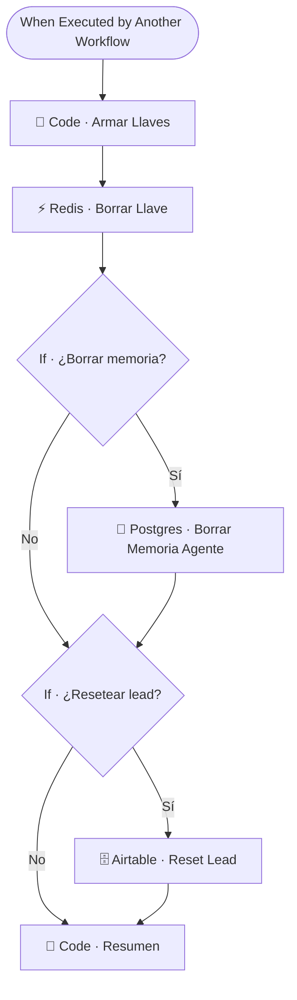

# 🧹 SUB · Reset Lead

| Campo | Valor |
|---|---|
| **Archivo fuente** | `Workflow/Sub-Worflow/🧹 SUB · Reset Lead (Rivas Motors - Bajaj Sureste).json` |
| **ID n8n** | `C363QNZlBOamY6KZ` |
| **Estado** | **Inactivo** |
| **Categoría** | Utilidad — Mantenimiento / Testing |
| **Nodos** | 8 |
| **Trigger** | `executeWorkflowTrigger` |

## 1. Resumen

Herramienta de mantenimiento y testing: borra todas las llaves de Redis asociadas a un lead, opcionalmente su memoria conversacional en Postgres, y opcionalmente resetea su registro en Airtable. Pensada para reiniciar pruebas end-to-end reutilizando el mismo número de teléfono sin arrastrar estado de conversaciones anteriores.

## 2. Trigger

`executeWorkflowTrigger` — inputs: `user_id_canal`, `borrar_memoria_postgres` (boolean), y flags similares para resetear el lead.

## 3. Contrato de datos

### Salida
`Code · Resumen`: detalle de qué llaves se borraron y qué acciones se ejecutaron.

## 4. Flujo del proceso

1. Normaliza el teléfono y arma todas las llaves de Redis asociadas al lead (soporta múltiples formatos de número).
2. Borra cada llave de Redis.
3. Si se solicitó, borra la memoria del agente en Postgres (`DELETE FROM n8n_chat_memory_bajajsureste WHERE session_id = $1`).
4. Si se solicitó, resetea el registro del lead en Airtable.
5. Arma un resumen de lo ejecutado.

## 5. Diagrama de flujo (UML)

## 6. Integraciones externas

| Sistema | Uso |
|---|---|
| Redis | Borrado de todas las llaves del lead |
| Postgres | Borrado de memoria conversacional del agente |
| Airtable | Reset del registro del lead |

## 7. Relación con otros workflows

- **Invocado por**: nadie en producción (herramienta de testing manual).
- **Invoca a**: ninguno.

## 8. Reglas de negocio y notas técnicas

- **No usar en producción con leads reales**: este workflow borra información de negocio (historial, score, etapa) de forma irreversible si se activa `resetear_lead`. Su propósito es exclusivamente pruebas de desarrollo.
- La tabla de memoria Postgres referenciada (`n8n_chat_memory_bajajsureste`) sugiere que el nombre de tabla de memoria es **específico del canal Bajaj Sureste** — verificar si existe un equivalente para Rivas Motors o si ambos canales comparten la misma tabla de memoria (dato relevante para entender el alcance real del reset).
