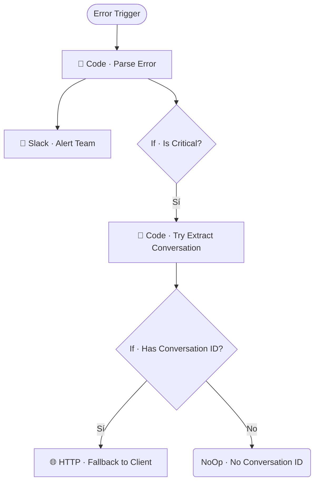

# ⚠️ Error Handler Global

| Campo | Valor |
|---|---|
| **Archivo fuente** | `Workflow/Sub-Worflow/⚠️ Error Handler Global (Rivas Motors- Bajaja Sureste).json` |
| **ID n8n** | `A4QD9B2JE2Bb72nh` |
| **Estado** | Activo |
| **Categoría** | Utilidad — Resiliencia / Observabilidad |
| **Nodos** | 8 |
| **Trigger** | `errorTrigger` (workflow de manejo de errores de n8n) |

## 1. Resumen

Captura cualquier error no manejado de cualquier workflow del proyecto que lo tenga configurado como su *Error Workflow*, clasifica severidad, alerta al equipo por Slack, e intenta — best-effort — avisar al cliente final vía Chatwoot si logra extraer un `conversation_id` del contexto del error.

## 2. Trigger

`n8n-nodes-base.errorTrigger` — se dispara automáticamente cuando otro workflow (configurado para usar este como su Error Workflow) falla.

## 3. Contrato de datos

### Entrada
Objeto de ejecución fallida de n8n (`execution`, `workflow`, incluyendo el nodo que falló y el stack de error).

### Salida
Sin retorno — efectos: mensaje en Slack, y opcionalmente mensaje de fallback al cliente en Chatwoot.

## 4. Flujo del proceso

1. Parsea el error (workflow origen, nodo que falló, mensaje) y clasifica su severidad.
2. Siempre notifica al canal de Slack del equipo.
3. Si el error es crítico, intenta extraer un `conversation_id` del mensaje de error o del stack (best-effort, vía regex/heurística).
4. Si logra extraerlo, envía un mensaje de disculpa/fallback al cliente vía Chatwoot; si no, se queda solo con la alerta interna de Slack.

## 5. Diagrama de flujo (UML)

## 6. Integraciones externas

| Sistema | Uso |
|---|---|
| Slack | Alerta al equipo de cualquier error |
| Chatwoot (HTTP) | Mensaje de fallback al cliente cuando es posible identificar la conversación |

## 7. Relación con otros workflows

- **Invocado por**: n8n automáticamente, cuando cualquier workflow configurado con este como *Error Workflow* falla. No es invocado explícitamente vía `executeWorkflow`.
- **Invoca a**: ninguno.

## 8. Reglas de negocio y notas técnicas

- La extracción de `conversation_id` es **best-effort** (heurística sobre texto de error/stack) — no está garantizado que siempre lo encuentre, incluso si el error ocurrió en medio de una conversación real. Es un mecanismo de mitigación, no de recuperación garantizada.
- Verificar en n8n que **todos** los 25 sub-workflows y el `MAIN` tengan configurado este workflow como su Error Workflow — si alguno no lo tiene, sus fallos no generarán alerta ni fallback al cliente.
